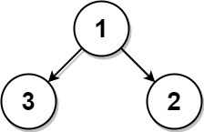
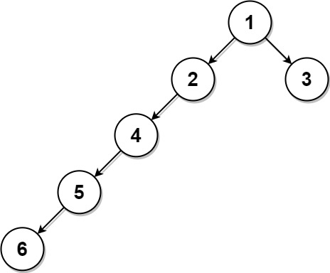

# 742 二叉樹最近的葉結點

給定一個 每個結點的值互不相同 的二叉樹，和一個目標值 k，找出樹中與目標值 k 最近的葉結點。 

這里，與葉結點 最近 表示在二叉樹中到達該葉節點需要行進的邊數與到達其它葉結點相比最少。而且，當一個結點沒有孩子結點時稱其為葉結點。

在下面的例子中，輸入的樹以逐行的平鋪形式表示。實際上的有根樹 root 將以TreeNode對象的形式給出。

## Closest Leaf in a Binary Tree

Given the root of a binary tree where every node has a unique value and a target integer k, return the value of the nearest leaf node to the target k in the tree.

Nearest to a leaf means the least number of edges traveled on the binary tree to reach any leaf of the tree. Also, a node is called a leaf if it has no children.


### Constraints

* The number of nodes in the tree is in the range [1, 1000].
* 1 <= Node.val <= 1000
* All the values of the tree are unique.
* There exist some node in the tree where Node.val == k.

[LeetCode](https://leetcode-cn.com/problems/closest-leaf-in-a-binary-tree/)


### Example 1



```
Input: root = [1,3,2], k = 1
Output: 2
Explanation: Either 2 or 3 is the nearest leaf node to the target of 1.
```

### Example 2



```
Input: root = [1,2,3,4,null,null,null,5,null,6], k = 2
Output: 3
Explanation: The leaf node with value 3 (and not the leaf node with value 6) is nearest to the node with value 2.
```

### C++ 

* 時間複雜度 O(N)
* 空間複雜度 O(N)


```
/**
 * Definition for a binary tree node.
 * struct TreeNode {
 *     int val;
 *     TreeNode *left;
 *     TreeNode *right;
 *     TreeNode() : val(0), left(nullptr), right(nullptr) {}
 *     TreeNode(int x) : val(x), left(nullptr), right(nullptr) {}
 *     TreeNode(int x, TreeNode *left, TreeNode *right) : val(x), left(left), right(right) {}
 * };
 */
class Solution {
private:
    // pair的第一位是距離，第二位是那個點的值
    pair<int,int> minDist{INT_MAX,0};
    bool found{false};
    pair<int,int> postOrder(TreeNode* root, const int& target)
    {
        if(root == nullptr)
            return {INT_MAX,-1};
        
        auto&& left = postOrder(root->left, target);
        auto&& right = postOrder(root->right, target);

        auto tempMin = min(left, right); //到該節點目前最近的葉子節點
        if(tempMin.second == -1)
        {   
            tempMin.first = 0; 
            tempMin.second = root->val;
        }
        if(root->val == target)
        {   
            found = true; 
            minDist = min(minDist, tempMin);
            
            return {1, target};
        }

        if(found == true && (left.second == target || right.second == target) && (left.second != -1 && right.second != -1))
        {   pair<int,int> temp;
            temp.first = left.first + right.first;
            temp.second = left.second == target? right.second : left.second;
            minDist = min(minDist, temp);
        }
        ++tempMin.first;

        return tempMin;
    }
public:
    int findClosestLeaf(TreeNode* root, int k) {
        
        (void)postOrder(root,k);

        return minDist.second;
    }
};
```
