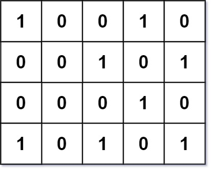
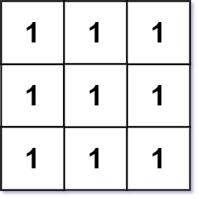

# 750 角矩形的數量

給定一個只包含 0 和 1 的網格，找出其中角矩形的數量。

一個「角矩形」是由四個不同的在網格上的 1 形成的軸對稱的矩形。注意只有角的位置才需要為 1。並且，4 個 1 需要是不同的。

## Number Of Corner Rectangles

Given an m x n integer matrix grid where each entry is only 0 or 1, return the number of corner rectangles.

A corner rectangle is four distinct 1's on the grid that forms an axis-aligned rectangle. Note that only the corners need to have the value 1. Also, all four 1's used must be distinct.

### Constraints

* m == grid.length
* n == grid[i].length
* 1 <= m, n <= 200
* grid[i][j] is either 0 or 1.
* The number of 1's in the grid is in the range [1, 6000].

[LeetCode](https://leetcode-cn.com/problems/number-of-corner-rectangles/)


### Example 1



```
Input: grid = [[1,0,0,1,0],[0,0,1,0,1],[0,0,0,1,0],[1,0,1,0,1]]
Output: 1
Explanation: There is only one corner rectangle, with corners grid[1][2], grid[1][4], grid[3][2], grid[3][4].
```


### Example 2



```
Input: grid = [[1,1,1],[1,1,1],[1,1,1]]
Output: 9
Explanation: There are four 2x2 rectangles, four 2x3 and 3x2 rectangles, and one 3x3 rectangle.
```

### C++ 

```
class Solution {
public:
    int countCornerRectangles(vector<vector<int>>& grid) {
        int&& rowNum = grid.size();
        int&& colNum = grid[0].size();
        /**
          每一row和其他的row匹配，確認其共都為1的個數 n
          由個數可求得可組成的長方型數量 (n) * (n - 1) / 2
        **/
        int count = 0;
        for(int row = 0; row < rowNum; ++row)
        {
            for(int secRow = row + 1; secRow < rowNum; ++secRow)
            {
                int tempCount = 0;
                for(int col = 0; col < colNum; ++col)
                {
                    if(grid[row][col] == 1 && grid[secRow][col] == 1)
                        ++tempCount;
                }
                count += (tempCount) * (tempCount - 1) / 2;
            }
        }

        return count;        
    }
};
```
