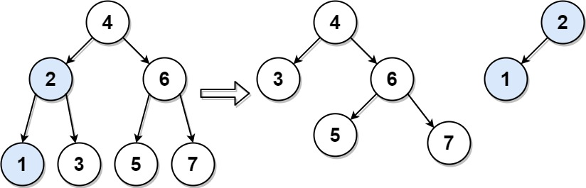

# 776 拆分二叉搜索樹

給你一棵二叉搜索樹（BST）、它的根結點 root 以及目標值 V。

請將該樹按要求拆分為兩個子樹：其中一個子樹結點的值都必須小於等於給定的目標值 V；另一個子樹結點的值都必須大於目標值 V；樹中並非一定要存在值為 V 的結點。

除此之外，樹中大部分結構都需要保留，也就是說原始樹中父節點 P 的任意子節點 C，假如拆分後它們仍在同一個子樹中，那麼結點 P 應仍為 C 的父結點。

你需要返回拆分後兩個子樹的根結點 TreeNode，順序隨意。

## Split BST

Given the root of a binary search tree (BST) and an integer target, split the tree into two subtrees where one subtree has nodes that are all smaller or equal to the target value, while the other subtree has all nodes that are greater than the target value. It Is not necessarily the case that the tree contains a node with the value target.

Additionally, most of the structure of the original tree should remain. Formally, for any child c with parent p in the original tree, if they are both in the same subtree after the split, then node c should still have the parent p.

Return an array of the two roots of the two subtrees.

### Constraints

* The number of nodes in the tree is in the range [1, 50].
* 0 <= Node.val, target <= 1000

[LeetCode](https://leetcode-cn.com/problems/split-bst/)


### Example 1



```
Input: root = [4,2,6,1,3,5,7], target = 2
Output: [[2,1],[4,3,6,null,null,5,7]]
```

### C++ 

```
/**
 * Definition for a binary tree node.
 * struct TreeNode {
 *     int val;
 *     TreeNode *left;
 *     TreeNode *right;
 *     TreeNode() : val(0), left(nullptr), right(nullptr) {}
 *     TreeNode(int x) : val(x), left(nullptr), right(nullptr) {}
 *     TreeNode(int x, TreeNode *left, TreeNode *right) : val(x), left(left), right(right) {}
 * };
 */
class Solution {
private:
    vector<TreeNode*> binarySearch(TreeNode* root, const int& target)
    {
        if(root == nullptr)
            return { nullptr, nullptr};
        
        if(root->val > target) //這個root屬於右分支
        {   //其左分支有可能被切有可能不被切，但總是要接屬於右分支的，也就是在下一步找出來
            vector<TreeNode*> temp = binarySearch(root -> left, target);
            root -> left = temp[1];
            return { temp[0], root};
        }
        else    //這個root屬於左分支
        {
            vector<TreeNode*> temp = binarySearch(root -> right, target);
            root -> right = temp[0];
            return { root, temp[1]};
        }
    }
    
public:
    vector<TreeNode*> splitBST(TreeNode* root, int target)
    {
        /*
           利用二叉搜索樹的特性 找下一個點
           若當前的點<= target值，代表我們要切的位在在這個點的右方
           利用dfs，每個dfs回傳兩個組 屬於左邊的樹 及屬於 右邊的樹
                 4          TARGET為 2
               /   \        第1刀要切在4的左邊，接下來走到 2
              2      6      第2刀要切在2的右邊，接下來走到 3
             / \    / \     第3刀要切在3的左邊，接下來走到 3的左分支
            1   3  5   7    3的左分支為空，故回傳 null null
                            2屬於左分支，其右分支要接3回傳的左分支，也就是null，回傳2, 及3回傳的右分支
                            4屬於右分支，其左分支要接2回傳的右分支，回傳 2回傳的左分支，及 4
        */      

        vector<TreeNode*> ret = binarySearch(root, target);

        return ret;
    }
};
```
