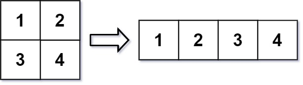

# 566 Reshape the Matrix

In MATLAB, there is a handy function called reshape which can reshape an m x n matrix into a new one with a different size r x c keeping its original data.

You are given an m x n matrix mat and two integers r and c representing the number of rows and the number of columns of the wanted reshaped matrix.

The reshaped matrix should be filled with all the elements of the original matrix in the same row-traversing order as they were.

If the reshape operation with given parameters is possible and legal, output the new reshaped matrix; Otherwise, output the original matrix.


## 重塑矩陣

在 MATLAB 中，有一個非常有用的函數 reshape ，它可以將一個 m x n 矩陣重塑為另一個大小不同（r x c）的新矩陣，但保留其原始數據。

給你一個由二維數組 mat 表示的 m x n 矩陣，以及兩個正整數 r 和 c ，分別表示想要的重構的矩陣的行數和列數。

重構後的矩陣需要將原始矩陣的所有元素以相同的 行遍歷順序 填充。

如果具有給定參數的 reshape 操作是可行且合理的，則輸出新的重塑矩陣；否則，輸出原始矩陣。


[LeetCode](https://leetcode-cn.com/problems/reshape-the-matrix/)



### Example 1
```
Input: mat = [[1,2],[3,4]], r = 1, c = 4
Output: [[1,2,3,4]]
```

### Example 2
```
Input: mat = [[1,2],[3,4]], r = 2, c = 4
Output: [[1,2],[3,4]]
```

* m == mat.length
* n == mat[i].length
* 1 <= m, n <= 100
* -1000 <= mat[i][j] <= 1000
* 1 <= r, c <= 300


### C++ 

* 時間複雜度：o(n) n 為矩陣的總原素 數目 

* 空間複雜度：o(1) 所輸出的矩陣不計

```
#include <vector>

using namespace std;

class Solution
{
public:
    vector<vector<int>> matrixReshape(vector<vector<int>> &mat, int r, int c)
    {
        int rowNum = mat.size();
        int colNum = mat[0].size();

        if ((rowNum * colNum != r * c) || (rowNum == r))
            return mat;

        int totalLen = rowNum * colNum;
        vector<vector<int>> ret(r, vector<int>(c, 0));

        for(int i = 0; i < totalLen; ++i)
            ret[i / c][i % c] = mat[i/colNum][i%colNum];
        

        return ret;
    }
};

int main()
{
    /* Input*/
    vector<vector<int>> input = {{ 1}, {2 }, { 3}, {4 }};

    /* unit test*/
    Solution test;
    vector<vector<int>> ret = test.matrixReshape(input, 2, 2);

    return 0;
}
```
