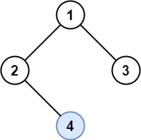

# 1469 Find All The Lonely Nodes

In a binary tree, a lonely node is a node that is the only child of its parent node. The root of the tree is not lonely because it does not have a parent node.

Given the root of a binary tree, return an array containing the values of all lonely nodes in the tree. Return the list in any order.

[LeetCode](https://leetcode.cn/problems/find-all-the-lonely-nodes/)

### Example 1



```
Input: root = [1,2,3,null,4]
Output: [4]
Explanation: Light blue node is the only lonely node.
Node 1 is the root and is not lonely.
Nodes 2 and 3 have the same parent and are not lonely.
```

### Example 2


```
Input: root = [11,99,88,77,null,null,66,55,null,null,44,33,null,null,22]
Output: [77,55,33,66,44,22]
Explanation: Nodes 99 and 88 share the same parent. Node 11 is the root.
All other nodes are lonely.
``` 

### Constraints

* 1 <= nums.length <= 10<sup>5</sup>
* The number of nodes in the tree is in the range [1, 1000].
* 1 <= Node.val <= 10<sup>6</sup>

### C++ 

```
/**
 * Definition for a binary tree node.
 * struct TreeNode {
 *     int val;
 *     TreeNode *left;
 *     TreeNode *right;
 *     TreeNode() : val(0), left(nullptr), right(nullptr) {}
 *     TreeNode(int x) : val(x), left(nullptr), right(nullptr) {}
 *     TreeNode(int x, TreeNode *left, TreeNode *right) : val(x), left(left), right(right) {}
 * };
 */
class Solution {
protected:
    void preOrder(TreeNode* root, vector<int>& ret){
        if(root == nullptr)
            return;
        
        if(root->left != nullptr && root->right == nullptr)
            ret.push_back(root->left->val);
        else if(root->left == nullptr && root->right != nullptr)
            ret.push_back(root->right->val);
        
        preOrder(root->left, ret);
        preOrder(root->right, ret);
    }
public:
    vector<int> getLonelyNodes(TreeNode* root) {
        vector<int> ret;
        preOrder(root, ret);

        return ret;
    }
};
```
