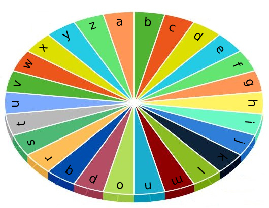

# 1974 Minimum Time to Type Word Using Special Typewriter

There is a special typewriter with lowercase English letters 'a' to 'z' arranged in a circle with a pointer. A character can only be typed if the pointer is pointing to that character. The pointer is initially pointing to the character 'a'.



Each second, you may perform one of the following operations:

* Move the pointer one character counterclockwise or clockwise.
* Type the character the pointer is currently on.
Given a string word, return the minimum number of seconds to type out the characters in word.


[LeetCode](https://leetcode.cn/problems/number-of-valid-words-in-a-sentence/)

### Example 1

```
Input: word = "abc"
Output: 5
Explanation: 
The characters are printed as follows:
- Type the character 'a' in 1 second since the pointer is initially on 'a'.
- Move the pointer clockwise to 'b' in 1 second.
- Type the character 'b' in 1 second.
- Move the pointer clockwise to 'c' in 1 second.
- Type the character 'c' in 1 second.
```

### Example 2

```
Input: word = "bza"
Output: 7
Explanation:
The characters are printed as follows:
- Move the pointer clockwise to 'b' in 1 second.
- Type the character 'b' in 1 second.
- Move the pointer counterclockwise to 'z' in 2 seconds.
- Type the character 'z' in 1 second.
- Move the pointer clockwise to 'a' in 1 second.
- Type the character 'a' in 1 second.
```

### Constraints

* 1 <= word.length <= 100
* word consists of lowercase English letters.

### C++ 

```
class Solution {
public:
    int minTimeToType(string word) {
        /*
           1. 可以向左也可以向右
               取大值走到小值為一種
               26 - 剛剛的值是一種
               兩者取小的                 
        */
        char curr = 'a';
        int sum  = 0;
        for(const char& tar : word){
            int&& diff = max(curr, tar) - min(curr, tar);
            int&& secDiff = 26 - diff;
            sum += min(diff, secDiff) + 1;
            curr = tar;
        }

        return sum;
    }
};
```