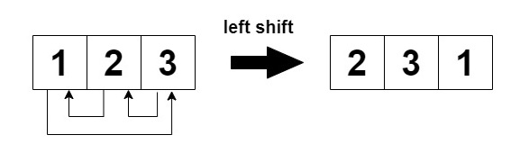
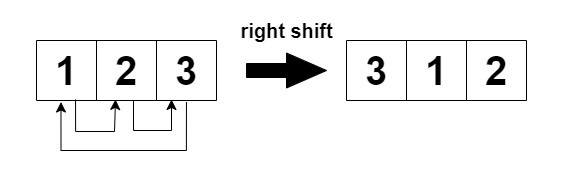

# 2946 Matrix Similarity After Cyclic Shifts

You are given an m x n integer matrix mat and an integer k. The matrix rows are 0-indexed.

The following proccess happens k times:

* Even-indexed rows (0, 2, 4, ...) are cyclically shifted to the left.



* Odd-indexed rows (1, 3, 5, ...) are cyclically shifted to the right.



Return true if the final modified matrix after k steps is identical to the original matrix, and false otherwise.

 
[LeetCode](https://leetcode.cn/problems/matrix-similarity-after-cyclic-shifts/)

### Example 1

```
Input: mat = [[1,2,3],[4,5,6],[7,8,9]], k = 4

Output: false

Explanation:

In each step left shift is applied to rows 0 and 2 (even indices), and right shift to row 1 (odd index).
```

### Example 2

```
Input: mat = [[1,2,1,2],[5,5,5,5],[6,3,6,3]], k = 2

Output: true

Explanation:
```

### Constraints

* 1 <= mat.length <= 25
* 1 <= mat[i].length <= 25
* 1 <= mat[i][j] <= 25
* 1 <= k <= 50


### C++ 

```
class Solution {
public:
    bool areSimilar(vector<vector<int>>& mat, int k) {
        /*
            如果移動的K和長度一致返回true
        */
        int&& rowNum = mat.size();
        int&& colNum = mat[0].size();
        
        if(colNum == k)
            return true;
        
        int offset = 0;
        k %= colNum;
        for(int row = 0; row < mat.size(); ++row){
            if(row & 1){
                offset = (-k + colNum) % colNum;
            } else {
                offset = k % colNum;
            }

            for(int col = 0; col < colNum; ++col){
                if(mat[row][col] != mat[row][offset])
                    return false;
                offset = (offset + 1) % colNum;
            }            
        }

        return true;
    }
};
```