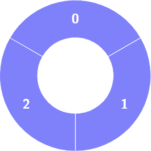

# 3206 Alternating Groups I

There is a circle of red and blue tiles. You are given an array of integers colors. The color of tile i is represented by colors[i]:

* colors[i] == 0 means that tile i is red.
* colors[i] == 1 means that tile i is blue.
Every 3 contiguous tiles in the circle with alternating colors (the middle tile has a different color from its left and right tiles) is called an alternating group.

Return the number of alternating groups.

Note that since colors represents a circle, the first and the last tiles are considered to be next to each other.
 
[LeetCode](https://leetcode.cn/problems/alternating-groups-i/)

### Example 1



```
Input: colors = [1,1,1]

Output: 0
```

### Example 2


```
Input: colors = [0,1,0,0,1]

Output: 3
```

### Constraints

* 3 <= colors.length <= 100
* 0 <= colors[i] <= 1

### C++ 

```
class Solution {
public:
    int numberOfAlternatingGroups(vector<int>& colors) {
        int&& len = colors.size();
        int ret = 0;
        for(int i = 0; i < len; ++i){
            int&& prev = (i - 1 + len) % len;
            int&& next = (i + 1) % len;
            if(colors[prev] == colors[next] && colors[prev] != colors[i])
                ++ret;
        }
        
        return ret;
    }
};
```