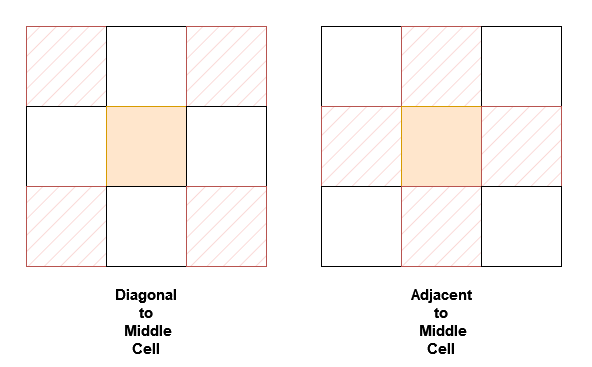

# 3242 Design Neighbor Sum Service

You are given a n x n 2D array grid containing distinct elements in the range [0, n2 - 1].

Implement the NeighborSum class:

* NeighborSum(int [][]grid) initializes the object.
* int adjacentSum(int value) returns the sum of elements which are adjacent neighbors of value, that is either to the top, left, right, or bottom of value in grid.
* int diagonalSum(int value) returns the sum of elements which are diagonal neighbors of value, that is either to the top-left, top-right, bottom-left, or bottom-right of value in grid.
 


[LeetCode](https://leetcode.cn/problems/design-neighbor-sum-service/)

### Example 1

```
Input:

["NeighborSum", "adjacentSum", "adjacentSum", "diagonalSum", "diagonalSum"]

[[[[0, 1, 2], [3, 4, 5], [6, 7, 8]]], [1], [4], [4], [8]]

Output: [null, 6, 16, 16, 4]
```

### Example 2

```
Input:

["NeighborSum", "adjacentSum", "diagonalSum"]

[[[[1, 2, 0, 3], [4, 7, 15, 6], [8, 9, 10, 11], [12, 13, 14, 5]]], [15], [9]]

Output: [null, 23, 45]
```

### Constraints

* 3 <= n == grid.length == grid[0].length <= 10
* 0 <= grid[i][j] <= n^2 - 1
* All grid[i][j] are distinct.
* value in adjacentSum and diagonalSum will be in the range [0, n^2 - 1].
* At most 2 * n2 calls will be made to adjacentSum and diagonalSum.

### C++ 

```
class NeighborSum {
protected:
    int rowNum{0};
    int colNum{0};
    int moves[4][2] = {{-1,0},{1,0},{0,-1},{0,1}};
    int diagMoves[4][2] = {{-1,-1},{1,1},{-1,1},{1,-1}};
    vector<vector<int>> grid;
public:
    NeighborSum(vector<vector<int>>& grid) {
        rowNum = grid.size();
        colNum = grid[0].size();
        this->grid = move(grid);
    }
    
    int adjacentSum(int value) {
        int ret = 0;
        for(int row = 0; row < rowNum; ++row){
            for(int col = 0; col < colNum; ++col){
                if(grid[row][col] == value){
                    for(int i = 0; i < 4; ++i){
                        int&& nextRow = row + moves[i][0];
                        int&& nextCol = col + moves[i][1];
                        if(nextRow >= 0 && nextRow < rowNum && nextCol >= 0 && nextCol < colNum)
                            ret += grid[nextRow][nextCol];
                    }
                }
            }
        }
        
        return ret;
    }
    
    int diagonalSum(int value) {

        int ret = 0;
        for(int row = 0; row < rowNum; ++row){
            for(int col = 0; col < colNum; ++col){
                if(grid[row][col] == value){
                    for(int i = 0; i < 4; ++i){
                        int&& nextRow = row + diagMoves[i][0];
                        int&& nextCol = col + diagMoves[i][1];
                        if(nextRow >= 0 && nextRow < rowNum && nextCol >= 0 && nextCol < colNum)
                            ret += grid[nextRow][nextCol];
                    }
                }
            }
        }
        
        return ret;        
    }
};

/**
 * Your NeighborSum object will be instantiated and called as such:
 * NeighborSum* obj = new NeighborSum(grid);
 * int param_1 = obj->adjacentSum(value);
 * int param_2 = obj->diagonalSum(value);
 */
```