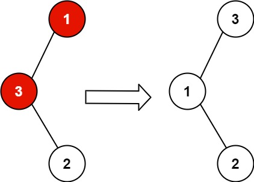

# 099 恢復二叉搜索樹

給你二叉搜索樹的根節點 root ，該樹中的 恰好 兩個節點的值被錯誤地交換。請在不改變其結構的情況下，恢覆這棵樹 。

## Convert Sorted Array to Binary Search Tree

Given an integer array nums where the elements are sorted in ascending order, convert it to a height-balanced binary search tree.

[LeetCode](https://leetcode.cn/problems/convert-sorted-array-to-binary-search-tree/)

### Example 1



```
Input: root = [1,3,null,null,2]
Output: [3,1,null,null,2]
Explanation: 3 cannot be a left child of 1 because 3 > 1. Swapping 1 and 3 makes the BST valid.
```

### Example 2


```
Input: root = [3,1,4,null,null,2]
Output: [2,1,4,null,null,3]
Explanation: 2 cannot be in the right subtree of 3 because 2 < 3. Swapping 2 and 3 makes the BST valid.
``` 

### Constraints

* The number of nodes in the tree is in the range [2, 1000].
* -22<sup>31</sup> <= Node.val <= 2<sup>31</sup> - 1


### C++ 

```
/**
 * Definition for a binary tree node.
 * struct TreeNode {
 *     int val;
 *     TreeNode *left;
 *     TreeNode *right;
 *     TreeNode() : val(0), left(nullptr), right(nullptr) {}
 *     TreeNode(int x) : val(x), left(nullptr), right(nullptr) {}
 *     TreeNode(int x, TreeNode *left, TreeNode *right) : val(x), left(left), right(right) {}
 * };
 */
class Solution {
public:
    void recoverTree(TreeNode* root) {
        /*  
            以中序遍歷輸出，因為是二叉搜索樹，先輸出的應該要比較小，觀察範例: 
            [1,3,null,null,2]
            3 2 1 -> 要交換3及1 , 第一對不正確的 3 & 2 中的3及第二對不正確的 2 & 1中的1

            [3,1,4,null,null,2]
            1 3 2 4 -> 交換2及3，第一點不正確 3 & 2 中的 2及3

            可得結論
            當找到第一個不正確的組合時，先紀下第1個node 及第2個node
            若有找到第二個不正確的組合，就更新第2個node
        */

        stack<TreeNode*> nodeStk;
        TreeNode* prevNode = nullptr;
        
        TreeNode* first = nullptr;
        TreeNode* second = nullptr;

        while(nodeStk.empty() != true || root != nullptr){
            while(root != nullptr){
                nodeStk.push(root);
                root = root -> left;
            }

            TreeNode* currNode = nodeStk.top();
            nodeStk.pop();
            root = currNode -> right;

            if(prevNode != nullptr && prevNode-> val > currNode -> val){
                second = currNode;
                if(first == nullptr)
                    first = prevNode;
                else
                    break;               
            }         

            prevNode = currNode;          
        }

        swap(first->val, second->val);
    }
};
```
