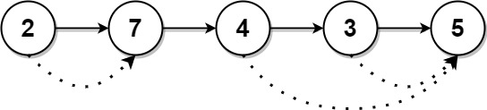

# 1019 Next Greater Node In Linked List

You are given the head of a linked list with n nodes.

For each node in the list, find the value of the next greater node. That is, for each node, find the value of the first node that is next to it and has a strictly larger value than it.

Return an integer array answer where answer[i] is the value of the next greater node of the ith node (1-indexed). If the ith node does not have a next greater node, set answer[i] = 0.

[LeetCode](https://leetcode.cn/problems/next-greater-node-in-linked-list/)


### Example 1


```
Input: head = [2,1,5]
Output: [5,5,0]
```

### Example 2



```
Input: head = [2,7,4,3,5]
Output: [7,0,5,5,0]
```

### Constraints

* The number of nodes in the list is n.
* 1 <= n <= 104
* 1 <= Node.val <= 10<sup>9</sup>

### C++ 

```
/**
 * Definition for singly-linked list.
 * struct ListNode {
 *     int val;
 *     ListNode *next;
 *     ListNode() : val(0), next(nullptr) {}
 *     ListNode(int x) : val(x), next(nullptr) {}
 *     ListNode(int x, ListNode *next) : val(x), next(next) {}
 * };
 */
class Solution {
public:
    vector<int> nextLargerNodes(ListNode* head) {
        /*
            使用一單調遞減棧找出右側比該數值大的第一個數
            由於是鍊表，每次進入到下一個節點時，就增加一個記錄
        */
        typedef pair<int,int> iPair;
        stack<iPair> valPosStk;
        vector<int> ret;
        
        while(head != nullptr){
            
            while(valPosStk.empty() != true && head->val > valPosStk.top().first){
                ret[valPosStk.top().second] = head->val;
                valPosStk.pop();
            }

            valPosStk.emplace(head->val, ret.size());
            ret.push_back(0);
            head = head->next;
        }

        return ret;
    }
};
```