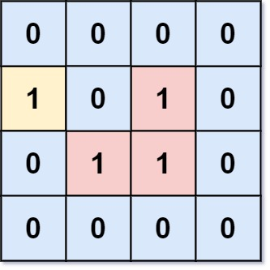
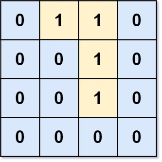

# 1020 Number of Enclaves

You are given an m x n binary matrix grid, where 0 represents a sea cell and 1 represents a land cell.

A move consists of walking from one land cell to another adjacent (4-directionally) land cell or walking off the boundary of the grid.

Return the number of land cells in grid for which we cannot walk off the boundary of the grid in any number of moves.

[LeetCode](https://leetcode.cn/problems/number-of-enclaves/)


### Example 1



```
Input: grid = [[0,0,0,0],[1,0,1,0],[0,1,1,0],[0,0,0,0]]
Output: 3
Explanation: There are three 1s that are enclosed by 0s, and one 1 that is not enclosed because its on the boundary.
```

### Example 2



```
Input: grid = [[0,1,1,0],[0,0,1,0],[0,0,1,0],[0,0,0,0]]
Output: 0
Explanation: All 1s are either on the boundary or can reach the boundary.
```

### Constraints

* m == grid.length
* n == grid[i].length
* 1 <= m, n <= 500
* grid[i][j] is either 0 or 1.

### C++ 

```
class Solution {
public:
    int numEnclaves(vector<vector<int>>& grid) {
        /*
            找出不與邊界相連為1的數量
            1. 先繞一週，將邊界上以及與其相連的1都轉變成0
            2. 再找出所有為1的數量
        */
        typedef pair<int,int> iPair;
        int moves[4][2] = {{-1,0},{1,0},{0,-1},{0,1}};
        
        int&& rowNum = grid.size();
        int&& colNum = grid[0].size();
        queue<iPair> que;
        //將與邊界相連的且為1的點全部移除(改成0)
        for(int row = 0; row < rowNum; ++row){
            for(int col = 0; col < colNum; ++col){
                if(grid[row][col] == 0 || (row != 0 && row != rowNum - 1 && col != 0 && col != colNum - 1) )
                    continue;
                que.emplace(row, col);
                grid[row][col] = 0;
                while(que.empty() != true){
                    iPair curr = move(que.front());
                    que.pop();

                    for(int i = 0; i < 4; ++i){
                        int&& nextRow = curr.first + moves[i][0];
                        int&& nextCol = curr.second + moves[i][1];

                        if(nextRow >= 0 && nextRow < rowNum && nextCol >= 0 && nextCol < colNum && grid[nextRow][nextCol] == 1){
                            que.emplace(nextRow, nextCol);
                            grid[nextRow][nextCol] = 0;
                        }
                    }
                }
            }
        }

        //計算剩餘的為1的數量
        int ret = 0;
        for(int row = 0; row < rowNum; ++row){
            for(int col = 0; col < colNum; ++col){
                if(grid[row][col] == 0)
                    continue;
                que.emplace(row, col);
                grid[row][col] = 0;
                ++ret;
                while(que.empty() != true){
                    iPair curr = move(que.front());
                    que.pop();

                    for(int i = 0; i < 4; ++i){
                        int&& nextRow = curr.first + moves[i][0];
                        int&& nextCol = curr.second + moves[i][1];

                        if(nextRow >= 0 && nextRow < rowNum && nextCol >= 0 && nextCol < colNum && grid[nextRow][nextCol] == 1){
                            que.emplace(nextRow, nextCol);
                            grid[nextRow][nextCol] = 0;
                            ++ret;
                        }
                    }
                }
            }
        }

        return ret;
    }
};
```