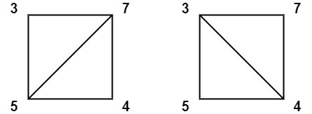

# 1039 Minimum Score Triangulation of Polygon

You have a convex n-sided polygon where each vertex has an integer value. You are given an integer array values where values[i] is the value of the ith vertex (i.e., clockwise order).

You will triangulate the polygon into n - 2 triangles. For each triangle, the value of that triangle is the product of the values of its vertices, and the total score of the triangulation is the sum of these values over all n - 2 triangles in the triangulation.

Return the smallest possible total score that you can achieve with some triangulation of the polygon.

[LeetCode](https://leetcode.cn/problems/binary-search-tree-to-greater-sum-tree/)


### Example 1



```
Input: values = [3,7,4,5]
Output: 144
Explanation: There are two triangulations, with possible scores: 3*7*5 + 4*5*7 = 245, or 3*4*5 + 3*4*7 = 144.
The minimum score is 144.
```

### Example 2


```
Input: values = [1,3,1,4,1,5]
Output: 13
Explanation: The minimum score triangulation has score 1*1*3 + 1*1*4 + 1*1*5 + 1*1*1 = 13.
```

### Constraints

* n == values.length
* 3 <= n <= 50
* 1 <= values[i] <= 100

### C++ 

```
class Solution {
public:
    int minScoreTriangulation(vector<int>& values) {
        /*
            使用動態規劃，每一個多邊形都由一個點切成
            左區域，start-mid-end 三角形，右區域
            當不足三個當時，為0
        */
        int&& len = values.size();
        vector<vector<int>> dp(len, vector<int>(len, INT_MAX));
        //
        for(int secLen = 2; secLen <= len; ++secLen){
            for(int start = 0; start < len; ++start){
                int&& end = start + secLen - 1;
                if( end >= len)
                    break;
                if(secLen == 2){
                    dp[start][end] = 0;
                    continue;
                }
                
                for(int mid = start + 1; mid < end; ++mid){
                    int& left = dp[start][mid];
                    int& right = dp[mid][end];
                    int&& tri = values[start] * values[mid] * values[end]; 
                    int&& tmp = left + right + tri;
                    dp[start][end] = min(dp[start][end], tmp);
                }
            }
        }
        
        return dp[0][len - 1];
    }
};
```