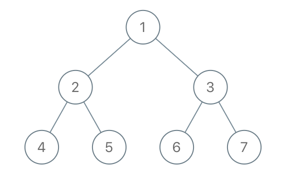

# 1110 Delete Nodes And Return Forest

Given the root of a binary tree, each node in the tree has a distinct value.

After deleting all nodes with a value in to_delete, we are left with a forest (a disjoint union of trees).

Return the roots of the trees in the remaining forest. You may return the result in any order.


[LeetCode](https://leetcode.cn/problems/delete-nodes-and-return-forest/)


### Example 1



```
Input: root = [1,2,3,4,5,6,7], to_delete = [3,5]
Output: [[1,2,null,4],[6],[7]]
```

### Example 2

```
Input: root = [1,2,4,null,3], to_delete = [3]
Output: [[1,2,4]]
```

### Constraints

* The number of nodes in the given tree is at most 1000.
* Each node has a distinct value between 1 and 1000.
* to_delete.length <= 1000
* to_delete contains distinct values between 1 and 1000.

### C++ 

```
/**
 * Definition for a binary tree node.
 * struct TreeNode {
 *     int val;
 *     TreeNode *left;
 *     TreeNode *right;
 *     TreeNode() : val(0), left(nullptr), right(nullptr) {}
 *     TreeNode(int x) : val(x), left(nullptr), right(nullptr) {}
 *     TreeNode(int x, TreeNode *left, TreeNode *right) : val(x), left(left), right(right) {}
 * };
 */
class Solution {
protected:
    void postOrder(TreeNode*& root, const unordered_set<int>& delList, vector<TreeNode*>& ret){
        if(root == nullptr)
            return;
        
        postOrder(root->left, delList, ret);
        postOrder(root->right, delList, ret);

        if(delList.contains(root->val)){
            if(root->left != nullptr)
                ret.push_back(root->left);
            if(root->right != nullptr)
                ret.push_back(root->right);
            root = nullptr;
        }

    }
public:
    vector<TreeNode*> delNodes(TreeNode* root, vector<int>& to_delete) {
        /*
            採用postOrder, 當該節點是被被刪除的
            1. 左右子分支若不無nullptr，成為新的樹，加入ret
               該節點變為nullptr(採用引用指針的方式)
        */

        unordered_set<int> delList(to_delete.begin(), to_delete.end());
        vector<TreeNode*> ret;
        postOrder(root, delList, ret);
        if(root != nullptr)
            ret.push_back(root);

        return ret;
    }
};
```