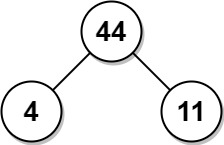

# 1130 Minimum Cost Tree From Leaf Values

Given an array arr of positive integers, consider all binary trees such that:

* Each node has either 0 or 2 children;
* The values of arr correspond to the values of each leaf in an in-order traversal of the tree.
* The value of each non-leaf node is equal to the product of the largest leaf value in its left and right subtree, respectively.

Among all possible binary trees considered, return the smallest possible sum of the values of each non-leaf node. It is guaranteed this sum fits into a 32-bit integer.

A node is a leaf if and only if it has zero children.


[LeetCode](https://leetcode.cn/problems/minimum-cost-tree-from-leaf-values/)


### Example 1


```
Input: arr = [6,2,4]
Output: 32
Explanation: There are two possible trees shown.
The first has a non-leaf node sum 36, and the second has non-leaf node sum 32.
```

### Example 2



```
Input: arr = [4,11]
Output: 44
```

### Constraints

* 2 <= arr.length <= 40
* 1 <= arr[i] <= 15
* It is guaranteed that the answer fits into a 32-bit signed integer (i.e., it is less than 2^31).

### C++ 

```
class Solution {
public:
    int mctFromLeafValues(vector<int>& arr) {
        /*
            動態規劃
            對於dp[i][j]代表從arr[i] - arr[j]的最小代價
            可將其拆解為 dp[i][k] + dp[k + 1][j] + maxLeaf[i][k] * maxLeaf[k + 1][j]
            DP需一個矩陣
            maxLeaf需另一個矩陣
        */
        int&& len = arr.size();
        vector<vector<int>> maxLeaf(len, vector<int>(len));

        for(int start = 0; start < len; ++start){
            int tmpMax = 0;
            for(int end = start; end < len; ++end){
                tmpMax = max(tmpMax, arr[end]);
                maxLeaf[start][end] = tmpMax;
            }
        }

        //
        vector<vector<int>> dp(len, vector<int>(len));
        for(int secLen = 2; secLen <= len; ++secLen){
            for(int start = 0; start < len; ++start){
                int&& end = start + secLen - 1;
                if(end >= len)
                    break;
                dp[start][end] = INT_MAX;
                for(int mid = start; mid < end; ++mid){
                    int&& maxLeafProduct = maxLeaf[start][mid] * maxLeaf[mid + 1][end];
                    dp[start][end] = min(dp[start][end], dp[start][mid] + dp[mid + 1][end] + maxLeafProduct);
                }
            }
        }
        
        return dp[0].back();
    }
};
```