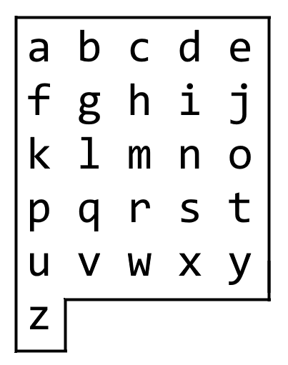

# 1138  Shortest Path with Alternating Colors

On an alphabet board, we start at position (0, 0), corresponding to character board[0][0].

Here, board = ["abcde", "fghij", "klmno", "pqrst", "uvwxy", "z"], as shown in the diagram below.



We may make the following moves:

* 'U' moves our position up one row, if the position exists on the board;
* 'D' moves our position down one row, if the position exists on the board;
* 'L' moves our position left one column, if the position exists on the board;
* 'R' moves our position right one column, if the position exists on the board;
* '!' adds the character board[r][c] at our current position (r, c) to the answer.
(Here, the only positions that exist on the board are positions with letters on them.)

Return a sequence of moves that makes our answer equal to target in the minimum number of moves.  You may return any path that does so.

[LeetCode](https://leetcode.cn/problems/longest-well-performing-interval/)


### Example 1

```
Input: target = "leet"
Output: "DDR!UURRR!!DDD!"
```

### Example 2

```
Input: target = "code"
Output: "RR!DDRR!UUL!R!"
```

### Constraints

* 1 <= target.length <= 100
* target consists only of English lowercase letters.

### C++ 

```
class Solution {
protected:
    typedef pair<int,int> iPair;
    int width = 5;
    pair<int,int> chr2Coordinate(const char& chr){
        int&& num = chr - 'a';
        int&& row = num / width;
        int&& col = num % width;
        
        return iPair(row, col);
    }
public:
    string alphabetBoardPath(string target) {
        /*
            將每一個位置都可以轉換成座標，目得與目前座標的差即為要走的方向
            可以簡單的先走上下，再走左右
            特殊字z，目標是Z，就向左到底再向下
            出發點是Z，向上一個之後再開始走
        */
        string ret;
        char curr = 'a';
        for(const char& targetChr : target){
            if(targetChr == curr){
                ret.push_back('!');
                continue;
            }
                
            if(curr == 'z'){
                ret.push_back('U');
                curr = 'u';
            }
            iPair currPair = chr2Coordinate(curr);

            if(targetChr == 'z'){
                ret.append(currPair.second, 'L');
                ret.append(5 - currPair.first, 'D');
            } else {
                iPair targetPair = chr2Coordinate(targetChr);
                int&& rowMove = targetPair.first - currPair.first;
                int&& colMove = targetPair.second - currPair.second;
                
                if(rowMove > 0)
                    ret.append(rowMove, 'D');
                else
                    ret.append(-rowMove, 'U');
                
                if(colMove > 0)
                    ret.append(colMove, 'R');
                else
                    ret.append(-colMove, 'L');
            }
            ret.push_back('!');
            
            curr = targetChr;
        }

        return ret;
    }
};
```