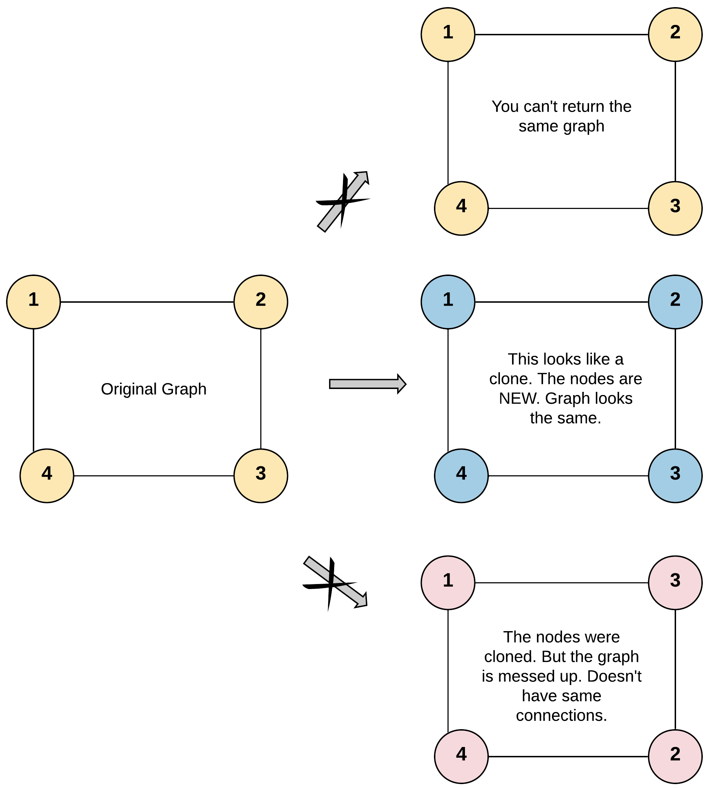

# 133 克隆圖

給你無向 連通 圖中一個節點的引用，請你返回該圖的 深拷貝（克隆）。

圖中的每個節點都包含它的值 val（int） 和其鄰居的列表（list[Node]）。

```
class Node {
    public int val;
    public List<Node> neighbors;
}
```

測試用例格式：

簡單起見，每個節點的值都和它的索引相同。例如，第一個節點值為 1（val = 1），第二個節點值為 2（val = 2），以此類推。該圖在測試用例中使用鄰接列表表示。

鄰接列表 是用於表示有限圖的無序列表的集合。每個列表都描述了圖中節點的鄰居集。

給定節點將始終是圖中的第一個節點（值為 1）。你必須將 給定節點的拷貝 作為對克隆圖的引用返回。

## Clone Graph

Given a reference of a node in a connected undirected graph.

Return a deep copy (clone) of the graph.

Each node in the graph contains a value (int) and a list (List[Node]) of its neighbors.

```
class Node {
    public int val;
    public List<Node> neighbors;
}
```

Test case format:

For simplicity, each node's value is the same as the node's index (1-indexed). For example, the first node with val == 1, the second node with val == 2, and so on. The graph is represented in the test case using an adjacency list.

An adjacency list is a collection of unordered lists used to represent a finite graph. Each list describes the set of neighbors of a node in the graph.

The given node will always be the first node with val = 1. You must return the copy of the given node as a reference to the cloned graph.

[LeetCode](https://leetcode.cn/problems/clone-graph/)

### Example 1



```
Input: adjList = [[2,4],[1,3],[2,4],[1,3]]
Output: [[2,4],[1,3],[2,4],[1,3]]
Explanation: There are 4 nodes in the graph.
1st node (val = 1)'s neighbors are 2nd node (val = 2) and 4th node (val = 4).
2nd node (val = 2)'s neighbors are 1st node (val = 1) and 3rd node (val = 3).
3rd node (val = 3)'s neighbors are 2nd node (val = 2) and 4th node (val = 4).
4th node (val = 4)'s neighbors are 1st node (val = 1) and 3rd node (val = 3).
```

### Example 2


```
Input: adjList = [[]]
Output: [[]]
Explanation: Note that the input contains one empty list. The graph consists of only one node with val = 1 and it does not have any neighbors.
```

### Constraints

* The number of nodes in the graph is in the range [0, 100].
* 1 <= Node.val <= 100
* Node.val is unique for each node.
* There are no repeated edges and no self-loops in the graph.
* The Graph is connected and all nodes can be visited starting from the given node.


### C++ 

```
/*
// Definition for a Node.
class Node {
public:
    int val;
    vector<Node*> neighbors;
    Node() {
        val = 0;
        neighbors = vector<Node*>();
    }
    Node(int _val) {
        val = _val;
        neighbors = vector<Node*>();
    }
    Node(int _val, vector<Node*> _neighbors) {
        val = _val;
        neighbors = _neighbors;
    }
};
*/

class Solution {
public:
    Node* cloneGraph(Node* node) {
        if(node == nullptr)
            return node;
        /*
            使用BFS，將還沒有處理相鄰節點的node入列
            需紀錄已經處理過的node
        */
        unordered_set<int> visted;
        unordered_map<int, Node*> links;
        typedef pair<Node*, Node*> iPair;

        queue<iPair> nodeQue;  //前方為原始的點，後方為克隆的點
        Node* ret = new Node(node->val); 
        links[node->val] = ret;

        nodeQue.emplace(node, ret);
        visted.insert(node -> val);

        while(nodeQue.empty() != true){
            iPair currNode = nodeQue.front();
            nodeQue.pop();
            // if(visted.insert(currNode.first -> val).second != true)
            //     continue;

            //處理其相類的點
            for(Node* next : currNode.first -> neighbors){
                if(links.find(next->val) == links.end()){ //這個點尚未建立
                    Node* copyNext = new Node(next->val);
                    links[next->val] = copyNext;
                }
                currNode.second -> neighbors.push_back(links[next->val]);
                if(visted.find(next->val) == visted.end()){
                    nodeQue.emplace(next, links[next->val]);
                    visted.insert(next -> val);
                }                
            }
        }
        
        return ret;
    }
};
```
