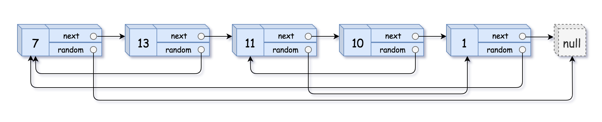

# 138 複製帶隨機指針的鍊表

給你一個長度為 n 的鏈表，每個節點包含一個額外增加的隨機指針 random ，該指針可以指向鏈表中的任何節點或空節點。

構造這個鏈表的 深拷貝。 深拷貝應該正好由 n 個 全新 節點組成，其中每個新節點的值都設為其對應的原節點的值。新節點的 next 指針和 random 指針也都應指向覆制鏈表中的新節點，並使原鏈表和覆制鏈表中的這些指針能夠表示相同的鏈表狀態。覆制鏈表中的指針都不應指向原鏈表中的節點 。

例如，如果原鏈表中有 X 和 Y 兩個節點，其中 X.random --> Y 。那麽在覆制鏈表中對應的兩個節點 x 和 y ，同樣有 x.random --> y 。

返回覆制鏈表的頭節點。

用一個由 n 個節點組成的鏈表來表示輸入/輸出中的鏈表。每個節點用一個 [val, random_index] 表示：

* val：一個表示 Node.val 的整數。
* random_index：隨機指針指向的節點索引（範圍從 0 到 n-1）；如果不指向任何節點，則為  null 。
你的代碼 只 接受原鏈表的頭節點 head 作為傳入參數。

## Copy List with Random Pointer

A linked list of length n is given such that each node contains an additional random pointer, which could point to any node in the list, or null.

Construct a deep copy of the list. The deep copy should consist of exactly n brand new nodes, where each new node has its value set to the value of its corresponding original node. Both the next and random pointer of the new nodes should point to new nodes in the copied list such that the pointers in the original list and copied list represent the same list state. None of the pointers in the new list should point to nodes in the original list.

For example, if there are two nodes X and Y in the original list, where X.random --> Y, then for the corresponding two nodes x and y in the copied list, x.random --> y.

Return the head of the copied linked list.

The linked list is represented in the input/output as a list of n nodes. Each node is represented as a pair of [val, random_index] where:

* val: an integer representing Node.val
* random_index: the index of the node (range from 0 to n-1) that the random pointer points to, or null if it does not point to any node.
Your code will only be given the head of the original linked list.

[LeetCode](https://leetcode.cn/problems/copy-list-with-random-pointer/)

### Example 1



```
Input: head = [[7,null],[13,0],[11,4],[10,2],[1,0]]
Output: [[7,null],[13,0],[11,4],[10,2],[1,0]]
```

### Example 2


```
Input: head = [[1,1],[2,1]]
Output: [[1,1],[2,1]]
``` 

### Example 3


```
Input: head = [[3,null],[3,0],[3,null]]
Output: [[3,null],[3,0],[3,null]]
```

### Constraints

* 0 <= n <= 1000
* -104 <= Node.val <= 10<sup>4</sup>
* Node.random is null or is pointing to some node in the linked list.


### C++ 

```
/*
// Definition for a Node.
class Node {
public:
    int val;
    Node* next;
    Node* random;
    
    Node(int _val) {
        val = _val;
        next = NULL;
        random = NULL;
    }
};
*/

class Solution {
public:
    Node* copyRandomList(Node* head) {
        /*
            使用pair將原鍊表與新鍊表封裝
            使用一個unorder_map<Node*, Node*>紀錄新產生的節點
            使用BFS處理下一點以及隨機點
        */
        if(head == nullptr)
            return nullptr;
            
        typedef pair<Node*, Node*> iPair;
        unordered_map<Node*, Node*> nodeMap;
        queue<iPair> nodeQue;
        Node* copyHead = new Node(head->val);
        nodeMap[head] = copyHead;
        nodeQue.emplace(head, copyHead);

        while(nodeQue.empty() != true){
            iPair currPair = move(nodeQue.front());
            nodeQue.pop();
                        
            //檢查random Node是否已建立
            if(currPair.first->random != nullptr){
                Node*& randomKey = currPair.first->random;
                if(nodeMap.find(randomKey) == nodeMap.end())
                    nodeMap[randomKey] = new Node(randomKey -> val);
                currPair.second->random = nodeMap[randomKey];
            }

            //檢查是否有next Node及該點是否已建立
            if(currPair.first->next != nullptr){
                Node*& nextKey = currPair.first->next;
                if(nodeMap.find(nextKey) == nodeMap.end())
                    nodeMap[nextKey] = new Node(nextKey -> val);
                currPair.second->next = nodeMap[nextKey];
                nodeQue.emplace(currPair.first->next, currPair.second->next);
            }
        }
        return copyHead;
    }
};
```
