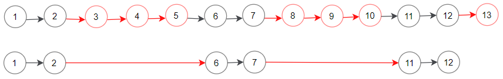

# 1474 Delete N Nodes After M Nodes of a Linked List

You are given the head of a linked list and two integers m and n.

Traverse the linked list and remove some nodes in the following way:

* Start with the head as the current node.
* Keep the first m nodes starting with the current node.
* Remove the next n nodes
* Keep repeating steps 2 and 3 until you reach the end of the list.
Return the head of the modified list after removing the mentioned nodes.
 

[LeetCode](https://leetcode.cn/problems/delete-n-nodes-after-m-nodes-of-a-linked-list/)


### Example 1



```
Input: head = [1,2,3,4,5,6,7,8,9,10,11,12,13], m = 2, n = 3
Output: [1,2,6,7,11,12]
Explanation: Keep the first (m = 2) nodes starting from the head of the linked List  (1 ->2) show in black nodes.
Delete the next (n = 3) nodes (3 -> 4 -> 5) show in read nodes.
Continue with the same procedure until reaching the tail of the Linked List.
Head of the linked list after removing nodes is returned.
```

### Constraints

* The number of nodes in the list is in the range [1, 10<sup>4</sup>].
* 1 <= Node.val <= 10<sup>4</sup>
* 1 <= m, n <= 1000

### C++ 

```
/**
 * Definition for singly-linked list.
 * struct ListNode {
 *     int val;
 *     ListNode *next;
 *     ListNode() : val(0), next(nullptr) {}
 *     ListNode(int x) : val(x), next(nullptr) {}
 *     ListNode(int x, ListNode *next) : val(x), next(next) {}
 * };
 */
class Solution {
public:
    ListNode* deleteNodes(ListNode* head, int m, int n) {
        int&& cycle = m + n;
        int cnt = 0;
        ListNode dummy(-1);
        ListNode* tail = &dummy;
        tail->next = head;

        while(head != nullptr){
            if(cnt++ < m){
                tail->next = head;
                tail = tail->next;
            }           
            head = head->next;
            cnt %= cycle;
        }
        tail->next = nullptr;

        return  dummy.next;
    }
};
```