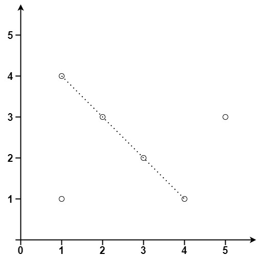

# 149 直線上最多的點數

給你一個數組 points ，其中 points[i] = [xi, yi] 表示 X-Y 平面上的一個點。求最多有多少個點在同一條直線上。

##  Max Points on a Line

Given an array of points where points[i] = [xi, yi] represents a point on the X-Y plane, return the maximum number of points that lie on the same straight line.

[LeetCode](https://leetcode.cn/problems/max-points-on-a-line/)

### Example 1


```
Input: points = [[1,1],[2,2],[3,3]]
Output: 3
```

### Example 2



```
Input: points = [[1,1],[3,2],[5,3],[4,1],[2,3],[1,4]]
Output: 4
``` 

### Constraints

* 1 <= points.length <= 300
* points[i].length == 2
* -10<sup>4</sup> <= xi, yi <=  10<sup>4</sup>


### C++ 

```
class Solution {
protected:
    int gcd(int a, int b){
        if(a % b == 0)
            return b;
        
        return gcd(b, a%b);
    }
public:
    int maxPoints(vector<vector<int>>& points) {
        /*
            從 i 點，匹配後面的i + 1 < points.size，因為都是從i出發
            若斜率相同，則共線，使用MAP記下斜率由i開始的幾組
        */
        int ret = 0;
        int&& len = points.size();
        if(len  <= 2)
            return len;
        unordered_map<int, int> slopeCnt;
        for(int i = 0; i < len; ++i){
            //n 個點最多只有 n - 1共線
            int&& tmpMax = len - i - 1;
            if(ret >= tmpMax)
                break;
            
            for(int j = i + 1; j < len; ++j){
                //因為除法的運算精度，所以不真的除，將兩數化成最簡分數
                int x = points[j][0] - points[i][0];
                int y = points[j][1] - points[i][1];

                //處理正負值，將y一律變正值
                if(y < 0){
                    y *= -1;
                    x *= -1;
                }

                if( x == 0){
                    y = 1;
                }
                else if(y == 0){
                    x = 0;
                }
                else{
                    int&& gcdVal = gcd(abs(x), abs(y));
                    x /= gcdVal;
                    y /= gcdVal; 
                }
                int&& tmpKey = (y << 15) | abs(x);
                if( x < 0)
                    tmpKey *= -1;
                slopeCnt[tmpKey]++;
                ret = max(ret, slopeCnt[tmpKey]);
            }
            slopeCnt.clear();
        }

        return ret + 1;
    }
};
```
