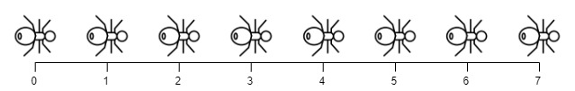

# 1503 Last Moment Before All Ants Fall Out of a Plank

We have a wooden plank of the length n units. Some ants are walking on the plank, each ant moves with a speed of 1 unit per second. Some of the ants move to the left, the other move to the right.

When two ants moving in two different directions meet at some point, they change their directions and continue moving again. Assume changing directions does not take any additional time.

When an ant reaches one end of the plank at a time t, it falls out of the plank immediately.

Given an integer n and two integer arrays left and right, the positions of the ants moving to the left and the right, return the moment when the last ant(s) fall out of the plank.
[LeetCode](https://leetcode.cn/problems/last-moment-before-all-ants-fall-out-of-a-plank/)

### Example 1


```
Input: n = 4, left = [4,3], right = [0,1]
Output: 4
Explanation: In the image above:
-The ant at index 0 is named A and going to the right.
-The ant at index 1 is named B and going to the right.
-The ant at index 3 is named C and going to the left.
-The ant at index 4 is named D and going to the left.
The last moment when an ant was on the plank is t = 4 seconds. After that, it falls immediately out of the plank. (i.e., We can say that at t = 4.0000000001, there are no ants on the plank).
```

### Example 2



```
Input: n = 7, left = [], right = [0,1,2,3,4,5,6,7]
Output: 7
Explanation: All ants are going to the right, the ant at index 0 needs 7 seconds to fall.

```
 

### Constraints

* 1 <= n <= 104
* 0 <= left.length <= n + 1
* 0 <= left[i] <= n
* 0 <= right.length <= n + 1
* 0 <= right[i] <= n
* 1 <= left.length + right.length <= n + 1
* All values of left and right are unique, and each value can appear only in one of the two arrays.

### C++ 

```
class Solution {
protected:
    unordered_map<int,uint64_t> lenMap;
    int getLen(const int& num){
        if(lenMap.contains(num))
            return lenMap[num];
        
        uint64_t&& half = getLen(num >> 1);
        if(num & 1)
            lenMap[num] = ((half * half) << 1) % MOD;
        else
            lenMap[num] = (half * half) % MOD;
    
        return lenMap[num];
    }
public:
    static constexpr int MOD = 1E9 + 7;
    int numSubseq(vector<int>& nums, int target) {
        /*
            由範例知道子序列不需要連續
            故只要找出符合的最大最小值
            e.g. 3, 5, 6，可有3 > 3, 5> 3, 6> 3,5,6
            一定要有最小值，其他的每個字都有兩個選擇(加/不加)
        */
        sort(nums.begin(), nums.end());
        lenMap[0] = 1;
        lenMap[1] = 2;
        int ret = 0;
        int left = 0;
        int right = nums.size() - 1;
        while(left <= right){
            if(nums[left] + nums[right] > target){
                --right;
            } else {
                int&& tmp = getLen(right - left);
                ret = (ret + tmp) % MOD;
                ++left;
            }
        }

        return ret;
    }
};
```