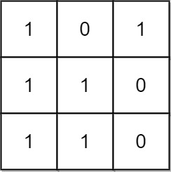

# 1504 Count Submatrices With All Ones

Given an m x n binary matrix mat, return the number of submatrices that have all ones.

[LeetCode](https://leetcode.cn/problems/last-moment-before-all-ants-fall-out-of-a-plank/)

### Example 1



```
Input: mat = [[1,0,1],[1,1,0],[1,1,0]]
Output: 13
Explanation: 
There are 6 rectangles of side 1x1.
There are 2 rectangles of side 1x2.
There are 3 rectangles of side 2x1.
There is 1 rectangle of side 2x2. 
There is 1 rectangle of side 3x1.
Total number of rectangles = 6 + 2 + 3 + 1 + 1 = 13.
```

### Example 2


```
Input: mat = [[0,1,1,0],[0,1,1,1],[1,1,1,0]]
Output: 24
Explanation: 
There are 8 rectangles of side 1x1.
There are 5 rectangles of side 1x2.
There are 2 rectangles of side 1x3. 
There are 4 rectangles of side 2x1.
There are 2 rectangles of side 2x2. 
There are 2 rectangles of side 3x1. 
There is 1 rectangle of side 3x2. 
Total number of rectangles = 8 + 5 + 2 + 4 + 2 + 2 + 1 = 24.

```
 

### Constraints

* 1 <= m, n <= 150
* mat[i][j] is either 0 or 1.

### C++ 

```
class Solution {
public:
    int numSubmat(vector<vector<int>>& mat) {
        /*
            2維，動態規劃，每次以[i][j]為矩型的右下角，確認能組成多少個
        */
        int&& rowNum = mat.size();
        int&& colNum = mat[0].size();
        vector<vector<int>> dp(rowNum, vector<int>(colNum));
        int ret = 0;

        for(int row = 0; row < rowNum; ++row){
            for(int col = 0; col < colNum; ++col){
                if(mat[row][col] == 0)
                    continue;
                
                
                dp[row][col] = col == 0? 1 : dp[row][col - 1] + 1;
                //開始計算以[row][col]為右下角可以組成多少個矩型
                int minLen = INT_MAX;
                for(int curr = row; curr >= 0; --curr){
                    minLen = min(minLen, dp[curr][col]);
                    ret += minLen;
                }
            }
        }

        return ret;
    }
};
```