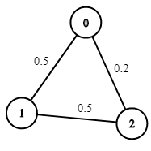
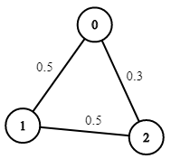

# 1514 Path with Maximum Probability

You are given an undirected weighted graph of n nodes (0-indexed), represented by an edge list where edges[i] = [a, b] is an undirected edge connecting the nodes a and b with a probability of success of traversing that edge succProb[i].

Given two nodes start and end, find the path with the maximum probability of success to go from start to end and return its success probability.

If there is no path from start to end, return 0. Your answer will be accepted if it differs from the correct answer by at most 1e-5.


[LeetCode](https://leetcode.cn/problems/path-with-maximum-probability/)

### Example 1



```
Input: n = 3, edges = [[0,1],[1,2],[0,2]], succProb = [0.5,0.5,0.2], start = 0, end = 2
Output: 0.25000
Explanation: There are two paths from start to end, one having a probability of success = 0.2 and the other has 0.5 * 0.5 = 0.25.
```

### Example 2



```
Input: n = 3, edges = [[0,1],[1,2],[0,2]], succProb = [0.5,0.5,0.3], start = 0, end = 2
Output: 0.30000
```

### Constraints

* 2 <= n <= 10^4
* 0 <= start, end < n
* start != end
* 0 <= a, b < n
* a != b
* 0 <= succProb.length == edges.length <= 2*10^4
* 0 <= succProb[i] <= 1
* There is at most one edge between every two nodes.

### C++ 

```
class Solution {
public:
    double maxProbability(int n, vector<vector<int>>& edges, vector<double>& succProb, int start_node, int end_node) {
        /*
            1.紀錄目前各點走到的機率，出發點為1，還未走到的為0
            2.使用BFS，記錄拓展的點
            3.若下一點已有數值，且走過去的機率比該點目前的值大，則更新，且入隊
        */
        unordered_map<int, vector<pair<int,double>>> graph;
        for(int i = 0; i < edges.size(); ++i){
            vector<int>& edge = edges[i];
            graph[edge[0]].emplace_back(edge[1], succProb[i]);
            graph[edge[1]].emplace_back(edge[0], succProb[i]);
        }

        vector<double> prob(n);
        prob[end_node] = 1.0;
        queue<int> que;
        que.push(end_node);

        while(que.empty() != true){
            int currNode = move(que.front());
            que.pop();

            for(const pair<int,double>& next : graph[currNode]){
                const int& nextNode = next.first;
                double&& nextProb = prob[currNode] * next.second;
                if(nextProb > prob[nextNode]){
                    prob[nextNode] = nextProb;
                    if(nextNode != start_node)
                        que.push(nextNode);
                }
            }
        }

        return prob[start_node];
    }
};
```