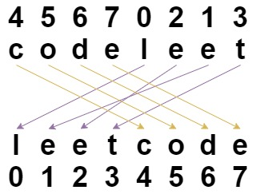

# 1528 Shuffle String

You are given a string s and an integer array indices of the same length. The string s will be shuffled such that the character at the ith position moves to indices[i] in the shuffled string.

Return the shuffled string.

[LeetCode](https://leetcode.cn/problems/shuffle-string/)

### Example 1



```
Input: low = 3, high = 7
Output: 3
Explanation: The odd numbers between 3 and 7 are [3,5,7].
```

### Example 2

```
Input: s = "abc", indices = [0,1,2]
Output: "abc"
Explanation: After shuffling, each character remains in its position.
```
 

### Constraints

* s.length == indices.length == n
* 1 <= n <= 100
* s consists of only lowercase English letters.
* 0 <= indices[i] < n
* All values of indices are unique.

### C++ 

```
class Solution {
public:
    string restoreString(string s, vector<int>& indices) {

        string ret(s.length(), ' ');
        for(int i = 0; i < s.length(); ++i){
            ret[indices[i]] = s[i];
        }

        return ret;
    }
};
```