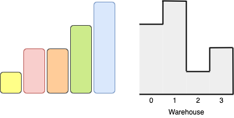

# 1564 Put Boxes Into the Warehouse I

You are given two arrays of positive integers, boxes and warehouse, representing the heights of some boxes of unit width and the heights of n rooms in a warehouse respectively. The warehouse's rooms are labelled from 0 to n - 1 from left to right where warehouse[i] (0-indexed) is the height of the ith room.

Boxes are put into the warehouse by the following rules:

* Boxes cannot be stacked.
* You can rearrange the insertion order of the boxes.
* Boxes can only be pushed into the warehouse from left to right only.
* If the height of some room in the warehouse is less than the height of a box, then that box and all other boxes behind it will be stopped before that room.
Return the maximum number of boxes you can put into the warehouse.

[LeetCode](https://leetcode.cn/problems/put-boxes-into-the-warehouse-i/)

### Example 1


```
Input: boxes = [4,3,4,1], warehouse = [5,3,3,4,1]
Output: 3
Explanation: 
```

### Example 2



```
Input: boxes = [1,2,2,3,4], warehouse = [3,4,1,2]
Output: 3
Explanation: 
```
 

### Constraints

* n == warehouse.length
* 1 <= boxes.length, warehouse.length <= 105
* 1 <= boxes[i], warehouse[i] <= 109

### C++ 

```
class Solution {
public:
    int maxBoxesInWarehouse(vector<int>& boxes, vector<int>& warehouse) {
        /*
            箱子要從房間的最左邊開始往裡面推，所以會受到路徑上的高度影響
            我們記下到達每個位子的實際上可允許的最大高度
        */
        int&& len = warehouse.size();
        vector<int> heightLimit(len);
        int maxHeight = warehouse[0];
        for(int i = 0; i < len; ++i){
            maxHeight = min(maxHeight, warehouse[i]);
            heightLimit[i] = maxHeight;            
        }

        int boxPtr = 0;
        sort(boxes.begin(), boxes.end());
        for(int i = len - 1; i >= 0 && boxPtr < boxes.size(); --i){
            if(heightLimit[i] >= boxes[boxPtr])
                boxPtr++;
        }

        return boxPtr;
    }
};
```