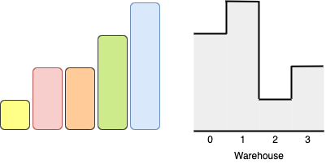
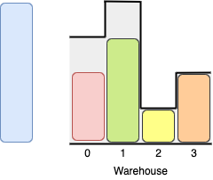
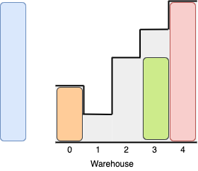

# 1580 Put Boxes Into the Warehouse II


You are given two arrays of positive integers, boxes and warehouse, representing the heights of some boxes of unit width and the heights of n rooms in a warehouse respectively. The warehouse's rooms are labeled from 0 to n - 1 from left to right where warehouse[i] (0-indexed) is the height of the ith room.

Boxes are put into the warehouse by the following rules:

Boxes cannot be stacked.
You can rearrange the insertion order of the boxes.
Boxes can be pushed into the warehouse from either side (left or right)
If the height of some room in the warehouse is less than the height of a box, then that box and all other boxes behind it will be stopped before that room.
Return the maximum number of boxes you can put into the warehouse.

[LeetCode](https://leetcode.cn/problems/put-boxes-into-the-warehouse-ii/)

### Example 1



```
Input: boxes = [1,2,2,3,4], warehouse = [3,4,1,2]
Output: 4
Explanation:
```


### Example 2


```
Input: boxes = [3,5,5,2], warehouse = [2,1,3,4,5]
Output: 3
Explanation:
```

 

### Constraints

* n == warehouse.length
* 1 <= boxes.length, warehouse.length <= 10<sup>5</sup>
* 1 <= boxes[i], warehouse[i] <= 10<sup>9</sup>

### C++ 

```
class Solution {
public:
    int maxBoxesInWarehouse(vector<int>& boxes, vector<int>& warehouse) {
        /*
            可以從左也可以從右邊進去，固每一個位置所能放的最大值是左右受路徑限制的最大值
        */
        int&& wareLen = warehouse.size();
        //找出每一個位置所能放的最大高度
        vector<int> limit(wareLen, INT_MAX);
        int prevLimit = INT_MAX;
        for(int i = wareLen - 1; i >= 0; --i){
            prevLimit = min(prevLimit, warehouse[i]);
            limit[i] = min(limit[i], prevLimit);
        }
        
        prevLimit = INT_MAX;
        for(int i = 0; i < wareLen; ++i){
            prevLimit = min(prevLimit, warehouse[i]);
            limit[i] = max(limit[i], prevLimit);
        }

        sort(limit.rbegin(), limit.rend());
        sort(boxes.rbegin(), boxes.rend());
        int ret = 0;
        for(int limitPtr = 0, boxPtr = 0; limitPtr < wareLen && boxPtr < boxes.size(); ++boxPtr){
            if(boxes[boxPtr] <= limit[limitPtr]){
                ++ret;
                ++limitPtr;
            }
        }

        return ret;        
    }
};
```