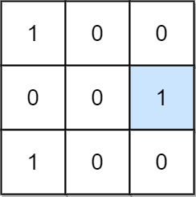

# 1582 Special Positions in a Binary Matrix

Given an m x n binary matrix mat, return the number of special positions in mat.

A position (i, j) is called special if mat[i][j] == 1 and all other elements in row i and column j are 0 (rows and columns are 0-indexed).

 
[LeetCode](https://leetcode.cn/problems/special-positions-in-a-binary-matrix/)

### Example 1



```
Output: 1
Explanation: (1, 2) is a special position because mat[1][2] == 1 and all other elements in row 1 and column 2 are 0.
```

### Example 2


```
Input: mat = [[1,1,1,1],
              [1,1,1,1],
              [1,1,1,1],
              [1,1,1,1]]
Output: 8
```
 

### Constraints

* m == mat.length
* n == mat[i].length
* 1 <= m, n <= 100
* mat[i][j] is either 0 or 1.

### C++ 

```
class Solution {
public:
    int numSpecial(vector<vector<int>>& mat) {
        int rowNum = mat.size();
        int colNum = mat[0].size();

        vector<int> rowCnt(rowNum, 0);
        vector<int> colCnt(colNum, 0);
        for(int row = 0; row < rowNum; ++row){
            for(int col = 0; col < colNum; ++col){
                if(mat[row][col] == 1){
                    rowCnt[row]++;
                    colCnt[col]++;
                }
            }
        }

        int ret = 0;
        for(int row = 0; row < rowNum; ++row){
            for(int col = 0; col < colNum; ++col){
                if(rowCnt[row] == 1 && colCnt[col] == 1 && mat[row][col] == 1)
                    ++ret;                
            }
        }

        return ret;
    }
};
```