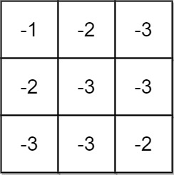

# 1594 Maximum Non Negative Product in a Matrix

You are given a m x n matrix grid. Initially, you are located at the top-left corner (0, 0), and in each step, you can only move right or down in the matrix.

Among all possible paths starting from the top-left corner (0, 0) and ending in the bottom-right corner (m - 1, n - 1), find the path with the maximum non-negative product. The product of a path is the product of all integers in the grid cells visited along the path.

Return the maximum non-negative product modulo 109 + 7. If the maximum product is negative, return -1.

Notice that the modulo is performed after getting the maximum product.

[LeetCode](https://leetcode.cn/problems/maximum-non-negative-product-in-a-matrix/)

### Example 1



```
Input: grid = [[-1,-2,-3],[-2,-3,-3],[-3,-3,-2]]
Output: -1
Explanation: It is not possible to get non-negative product in the path from (0, 0) to (2, 2), so return -1.
```

### Example 2

```
Input: grid = [[1,-2,1],[1,-2,1],[3,-4,1]]
Output: 8
Explanation: Maximum non-negative product is shown (1 * 1 * -2 * -4 * 1 = 8).
```
 

### Constraints

* m == grid.length
* n == grid[i].length
* 1 <= m, n <= 15
* -4 <= grid[i][j] <= 4

### C++ 

```
class Solution {
public:
    static constexpr int MOD = 1E9 + 7;
    int maxProductPath(vector<vector<int>>& grid) {
        /*
            因為是乘積。且數字有正有負，故dp要考量正負的情形
            需要考量第一行:初始狀況，以及第一列只能從上一行繼承
        */
        int&& rowNum = grid.size();
        int&& colNum = grid[0].size();
        bool zeroCell = false;
        vector<pair<int64_t,int64_t>> prevDp(colNum);

        //處理第一列
        prevDp[0].first = grid[0][0] >= 0? grid[0][0] : 0;
        prevDp[0].second = grid[0][0] < 0? grid[0][0] : 0; 
        zeroCell = grid[0][0] == 0? true : false;

        for(int i = 1; i < colNum; ++i){
            const int& num = grid[0][i];
            if(num == 0 && zeroCell == false)
                zeroCell = true;
            if(num > 0){
                prevDp[i].first = prevDp[i - 1].first * num;
                prevDp[i].second = prevDp[i - 1].second * num;
            } else if(num < 0){
                prevDp[i].first = prevDp[i -1].second * num;
                prevDp[i].second = prevDp[i - 1].first * num;
            } 
            prevDp[i].first %= MOD;
            prevDp[i].second %= MOD;
        }

        //處理餘下的matrix
        for(int row = 1; row < rowNum; ++row){
            vector<pair<int64_t,int64_t>> currDp(colNum);
            for(int col = 0; col < colNum; ++col){
                const int& num = grid[row][col];
                if(num == 0 && zeroCell == false)
                    zeroCell = true;
                if(num > 0){
                    //上方轉移
                    currDp[col].first = prevDp[col].first * num;   
                    currDp[col].second = prevDp[col].second * num; 
                    if(col > 0){ //左方轉移
                        currDp[col].first = max(currDp[col].first, currDp[col - 1].first * num);
                        currDp[col].second = min(currDp[col].second, currDp[col - 1].second * num);
                    }
                } else if(num < 0){
                    currDp[col].first = prevDp[col].second * num;
                    currDp[col].second = prevDp[col].first * num;
                    if(col > 0){//左方轉移
                        currDp[col].first = max(currDp[col].first, currDp[col - 1].second * num);
                        currDp[col].second = min(currDp[col].second, currDp[col - 1].first * num);
                    }
                }
            }
            prevDp = move(currDp);
        }

        return prevDp.back().first == 0 && zeroCell == false? -1 : prevDp.back().first % MOD;
    }
};
```