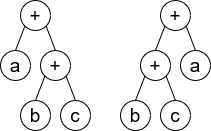

# 1612 Check If Two Expression Trees are Equivalent

A binary expression tree is a kind of binary tree used to represent arithmetic expressions. Each node of a binary expression tree has either zero or two children. Leaf nodes (nodes with 0 children) correspond to operands (variables), and internal nodes (nodes with two children) correspond to the operators. In this problem, we only consider the '+' operator (i.e. addition).

You are given the roots of two binary expression trees, root1 and root2. Return true if the two binary expression trees are equivalent. Otherwise, return false.

Two binary expression trees are equivalent if they evaluate to the same value regardless of what the variables are set to.

[LeetCode](https://leetcode.cn/problems/find-nearest-right-node-in-binary-tree/)

### Example 1



```
Input: root1 = [+,a,+,null,null,b,c], root2 = [+,+,a,b,c]
Output: true
Explanation: a + (b + c) == (b + c) + a
```

### Example 2


```
Input: root1 = [+,a,+,null,null,b,c], root2 = [+,+,a,b,d]
Output: false
Explanation: a + (b + c) != (b + d) + a
 
```

 

### Constraints

* The number of nodes in both trees are equal, odd and, in the range [1, 4999].
* Node.val is '+' or a lower-case English letter.
* It's guaranteed that the tree given is a valid binary expression tree.

### C++ 

```
/**
 * Definition for a binary tree node.
 * struct Node {
 *     char val;
 *     Node *left;
 *     Node *right;
 *     Node() : val(' '), left(nullptr), right(nullptr) {}
 *     Node(char x) : val(x), left(nullptr), right(nullptr) {}
 *     Node(char x, Node *left, Node *right) : val(x), left(left), right(right) {}
 * };
 */
class Solution {
protected:
    void getSum(Node* root, vector<int>& sum){
        if(root->left == nullptr && root->right == nullptr){
            sum[root->val - 'a']++;
            return;
        }
        
        getSum(root->left, sum);
        getSum(root->right, sum);
    }
public:
    bool checkEquivalence(Node* root1, Node* root2) {
        /*
            計算樹中的計算數值，最多有4999個點，如果前都是Z
        */
        vector<int> sum1(26);
        vector<int> sum2(26);
        getSum(root1, sum1);
        getSum(root2, sum2);

        return sum1 == sum2;        
    }
};
```