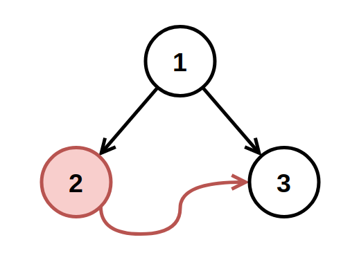
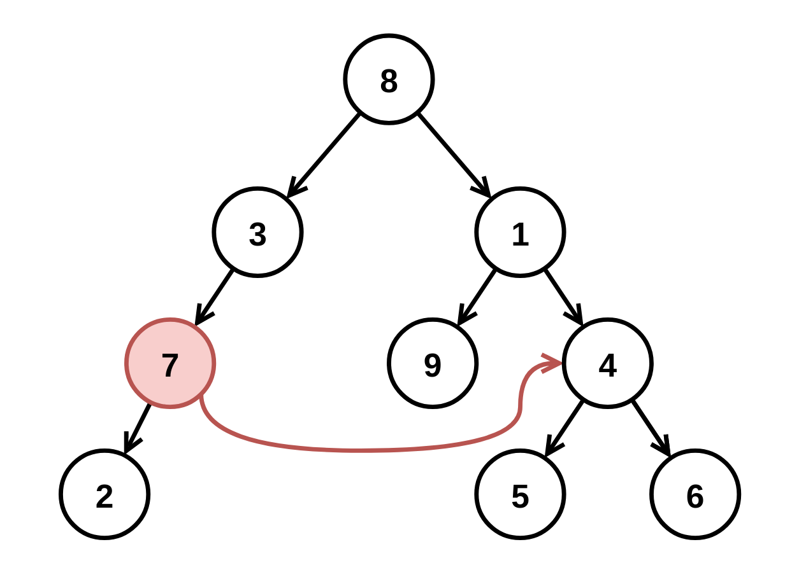

# 1660 Correct a Binary Tree

You have a binary tree with a small defect. There is exactly one invalid node where its right child incorrectly points to another node at the same depth but to the invalid node's right.

Given the root of the binary tree with this defect, root, return the root of the binary tree after removing this invalid node and every node underneath it (minus the node it incorrectly points to).

Custom testing:

The test input is read as 3 lines:

* TreeNode root
* int fromNode (not available to correctBinaryTree)
* int toNode (not available to correctBinaryTree)
After the binary tree rooted at root is parsed, the TreeNode with value of fromNode will have its right child pointer pointing to the TreeNode with a value of toNode. Then, root is passed to correctBinaryTree.

[LeetCode](You have a binary tree with a small defect. There is exactly one invalid node where its right child incorrectly points to another node at the same depth but to the invalid node's right.

Given the root of the binary tree with this defect, root, return the root of the binary tree after removing this invalid node and every node underneath it (minus the node it incorrectly points to).

Custom testing:

The test input is read as 3 lines:

TreeNode root
int fromNode (not available to correctBinaryTree)
int toNode (not available to correctBinaryTree)
After the binary tree rooted at root is parsed, the TreeNode with value of fromNode will have its right child pointer pointing to the TreeNode with a value of toNode. Then, root is passed to correctBinaryTree.)

### Example 1



```
Input: root = [1,2,3], fromNode = 2, toNode = 3
Output: [1,null,3]
Explanation: The node with value 2 is invalid, so remove it.
```

### Example 2



```
Input: root = [8,3,1,7,null,9,4,2,null,null,null,5,6], fromNode = 7, toNode = 4
Output: [8,3,1,null,null,9,4,null,null,5,6]
Explanation: The node with value 7 is invalid, so remove it and the node underneath it, node 2.
```

 

### Constraints

* The number of nodes in the tree is in the range [3, 10<sup>4</sup>].
* -10<sup>9</sup> <= Node.val <= 10<sup>9</sup>
* All Node.val are unique.
* fromNode != toNode
* fromNode and toNode will exist in the tree and will be on the same depth.
* toNode is to the right of fromNode.
* fromNode.right is null in the initial tree from the test data.

### C++ 

```
/**
 * Definition for a binary tree node.
 * struct TreeNode {
 *     int val;
 *     TreeNode *left;
 *     TreeNode *right;
 *     TreeNode() : val(0), left(nullptr), right(nullptr) {}
 *     TreeNode(int x) : val(x), left(nullptr), right(nullptr) {}
 *     TreeNode(int x, TreeNode *left, TreeNode *right) : val(x), left(left), right(right) {}
 * };
 */
class Solution {
public:
    TreeNode* correctBinaryTree(TreeNode* root) {
        /*
            1. 找到invalid node, 利用bfs一層一層的找
                將新增加的點放入一個set，當有重覆的點出現時，就該點從樹中移除
            2. remove他代表著，invalide node的父節點要刪除他，要保留父節點資訊
        */
        queue<TreeNode*> que;
        que.push(root);

        unordered_set<TreeNode*> currSet;
        unordered_set<TreeNode*> nextSet;
        currSet.insert(root);

        unordered_map<int, TreeNode*> currParent;
        unordered_map<int, TreeNode*> nextParent;
        currParent[root->val] = nullptr;
        bool removed = false;
        int cnt = 0;

        while(que.empty() != true && removed == false){
            int&& len = que.size();            
            while(len--){
                TreeNode* curr = que.front();
                que.pop();
                if(curr->left != nullptr){
                    que.push(curr->left); 
                    nextSet.insert(curr->left);
                    nextParent[curr->left->val] = curr;
                } 

                if(curr->right != nullptr){
                    if(currSet.contains(curr->right)){
                        //該點是要被移除的
                        TreeNode*& parent = currParent[curr->val]; 
                        if(parent->left != nullptr && parent->left->val == curr->val)
                            currParent[curr->val]->left = nullptr;
                        else
                            currParent[curr->val]->right = nullptr;
                        removed = true;
                        break;
                    } else {
                        que.push(curr->right); 
                        nextSet.insert(curr->right);
                        nextParent[curr->right->val] = curr;
                    }
                }                 
            }
            currSet = move(nextSet);
            currParent = move(nextParent);           
        }        

        return root;
    }
};
```