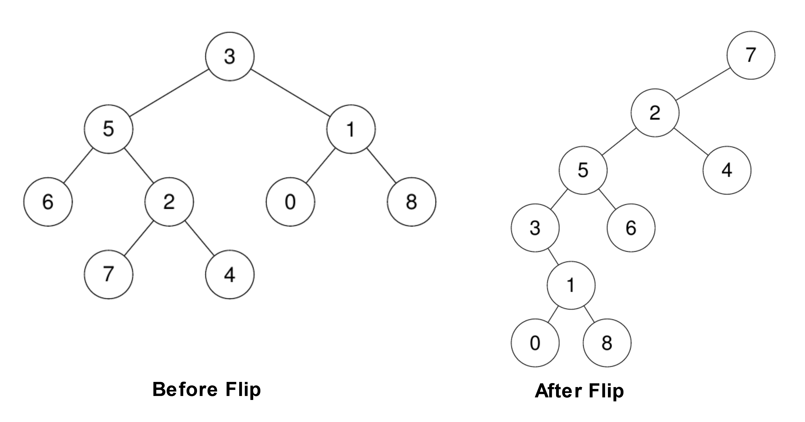

# 1666 Change the Root of a Binary Tree

Given the root of a binary tree and a leaf node, reroot the tree so that the leaf is the new root.

You can reroot the tree with the following steps for each node cur on the path starting from the leaf up to the root​​​ excluding the root:

If cur has a left child, then that child becomes cur's right child.
cur's original parent becomes cur's left child. Note that in this process the original parent's pointer to cur becomes null, making it have at most one child.
Return the new root of the rerooted tree.

Note: Ensure that your solution sets the Node.parent pointers correctly after rerooting or you will receive "Wrong Answer".

[LeetCode](https://leetcode.cn/problems/change-the-root-of-a-binary-tree/)

### Example 1



```
Input: root = [3,5,1,6,2,0,8,null,null,7,4], leaf = 7
Output: [7,2,null,5,4,3,6,null,null,null,1,null,null,0,8]
```

### Example 2

```
Input: root = [3,5,1,6,2,0,8,null,null,7,4], leaf = 0
Output: [0,1,null,3,8,5,null,null,null,6,2,null,null,7,4]
```

 

### Constraints


* The number of nodes in the tree is in the range [2, 100].
* -10<sup>9</sup> <= Node.val <= 10<sup>9</sup>
* All Node.val are unique.
* leaf exist in the tree.

### C++ 

```
/**
 * Definition for a binary tree node.
 * struct TreeNode {
 *     int val;
 *     TreeNode *left;
 *     TreeNode *right;
 *     TreeNode() : val(0), left(nullptr), right(nullptr) {}
 *     TreeNode(int x) : val(x), left(nullptr), right(nullptr) {}
 *     TreeNode(int x, TreeNode *left, TreeNode *right) : val(x), left(left), right(right) {}
 * };
 */
class Solution {
public:
    TreeNode* correctBinaryTree(TreeNode* root) {
        /*
            1. 找到invalid node, 利用bfs一層一層的找
                將新增加的點放入一個set，當有重覆的點出現時，就該點從樹中移除
            2. remove他代表著，invalide node的父節點要刪除他，要保留父節點資訊
        */
        queue<TreeNode*> que;
        que.push(root);

        unordered_set<TreeNode*> currSet;
        unordered_set<TreeNode*> nextSet;
        currSet.insert(root);

        unordered_map<int, TreeNode*> currParent;
        unordered_map<int, TreeNode*> nextParent;
        currParent[root->val] = nullptr;
        bool removed = false;
        int cnt = 0;

        while(que.empty() != true && removed == false){
            int&& len = que.size();            
            while(len--){
                TreeNode* curr = que.front();
                que.pop();
                if(curr->left != nullptr){
                    que.push(curr->left); 
                    nextSet.insert(curr->left);
                    nextParent[curr->left->val] = curr;
                } 

                if(curr->right != nullptr){
                    if(currSet.contains(curr->right)){
                        //該點是要被移除的
                        TreeNode*& parent = currParent[curr->val]; 
                        if(parent->left != nullptr && parent->left->val == curr->val)
                            currParent[curr->val]->left = nullptr;
                        else
                            currParent[curr->val]->right = nullptr;
                        removed = true;
                        break;
                    } else {
                        que.push(curr->right); 
                        nextSet.insert(curr->right);
                        nextParent[curr->right->val] = curr;
                    }
                }                 
            }
            currSet = move(nextSet);
            currParent = move(nextParent);           
        }        

        return root;
    }
};
```