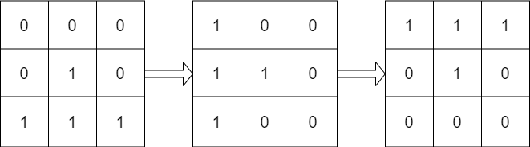

# 1886 Determine Whether Matrix Can Be Obtained By Rotation

Given two n x n binary matrices mat and target, return true if it is possible to make mat equal to target by rotating mat in 90-degree increments, or false otherwise.

[LeetCode](https://leetcode.cn/problems/determine-whether-matrix-can-be-obtained-by-rotation/)

### Example 1


```
Input: mat = [[0,1],[1,0]], target = [[1,0],[0,1]]
Output: true
Explanation: We can rotate mat 90 degrees clockwise to make mat equal target.
```

### Example 2



```
Input: mat = [[0,0,0],[0,1,0],[1,1,1]], target = [[1,1,1],[0,1,0],[0,0,0]]
Output: true
Explanation: We can rotate mat 90 degrees clockwise two times to make mat equal target.
```

### Constraints

* n == mat.length == target.length
* n == mat[i].length == target[i].length
* 1 <= n <= 10
* mat[i][j] and target[i][j] are either 0 or 1.


### C++ 

```
class Solution {
public:
    bool findRotation(vector<vector<int>>& mat, vector<vector<int>>& target) {
        /*
            一次性檢查整個matrix
            1st row V>S> last col
        */
        int&& len = mat.size();
        vector<vector<int>> roMax;
        for (int rotate = 0; rotate < 4; ++rotate) {
            roMax.clear();
            roMax.resize(len, vector<int>(len));
            bool identical = true;
            for (int i = 0; i < len; ++i) {
                for (int j = 0; j < len; ++j) {
                    roMax[j][len - i - 1] = mat[i][j];
                    if (mat[i][j] != target[j][len - i - 1])
                        identical = false;
                }
            }
            mat = move(roMax);
            if(identical == true)
                return true;
        }

        return false;
    }
};
```