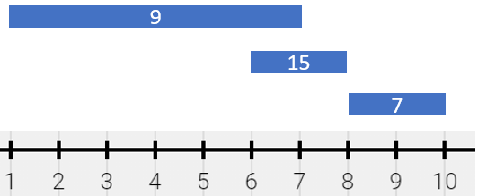

# 1943 Describe the Painting

There is a long and thin painting that can be represented by a number line. The painting was painted with multiple overlapping segments where each segment was painted with a unique color. You are given a 2D integer array segments, where segments[i] = [starti, endi, colori] represents the half-closed segment [starti, endi) with colori as the color.

The colors in the overlapping segments of the painting were mixed when it was painted. When two or more colors mix, they form a new color that can be represented as a set of mixed colors.

* For example, if colors 2, 4, and 6 are mixed, then the resulting mixed color is {2,4,6}.
For the sake of simplicity, you should only output the sum of the elements in the set rather than the full set.

You want to describe the painting with the minimum number of non-overlapping half-closed segments of these mixed colors. These segments can be represented by the 2D array painting where painting[j] = [leftj, rightj, mixj] describes a half-closed segment [leftj, rightj) with the mixed color sum of mixj.

* For example, the painting created with segments = [[1,4,5],[1,7,7]] can be described by painting = [[1,4,12],[4,7,7]] because:
    * [1,4) is colored {5,7} (with a sum of 12) from both the first and second segments.
    * [4,7) is colored {7} from only the second segment.
Return the 2D array painting describing the finished painting (excluding any parts that are not painted). You may return the segments in any order.

A half-closed segment [a, b) is the section of the number line between points a and b including point a and not including point b.
 

[LeetCode](https://leetcode.cn/problems/describe-the-painting/)

### Example 1


```
Input: segments = [[1,4,5],[4,7,7],[1,7,9]]
Output: [[1,4,14],[4,7,16]]
Explanation: The painting can be described as follows:
- [1,4) is colored {5,9} (with a sum of 14) from the first and third segments.
- [4,7) is colored {7,9} (with a sum of 16) from the second and third segments.
```

### Example 2



```
Input: segments = [[1,7,9],[6,8,15],[8,10,7]]
Output: [[1,6,9],[6,7,24],[7,8,15],[8,10,7]]
Explanation: The painting can be described as follows:
- [1,6) is colored 9 from the first segment.
- [6,7) is colored {9,15} (with a sum of 24) from the first and second segments.
- [7,8) is colored 15 from the second segment.
- [8,10) is colored 7 from the third segment.
```

 

### Constraints

* 1 <= segments.length <= 2 * 10<sup>4</sup>
* segments[i].length == 3
* 1 <= starti < endi <= 10<sup>5</sup>
* 1 <= colori <= 10<sup>9</sup>
* Each colori is distinct.


### C++ 

```
class Solution {
public:
    vector<vector<long long>> splitPainting(vector<vector<int>>& segments) {
        /*
            差分數組，使用hash的方式來存取
        */
        map<long long, long long> diffArray;
        for (const vector<int>& segment : segments) {
            diffArray[segment[0]] += segment[2];
            diffArray[segment[1]] -= segment[2];
        }

        vector<vector<long long>> ret;
        long long sum = 0;
        for (auto itr = diffArray.begin(); itr != diffArray.end(); ++itr) {
            if (sum != 0) {
                vector<long long> tmp(3);
                tmp[0] = prev(itr)->first;
                tmp[1] = itr->first;
                tmp[2] = sum;
                ret.push_back(move(tmp));
            }
            sum += itr->second;
        }

        return ret;
    }
};
```