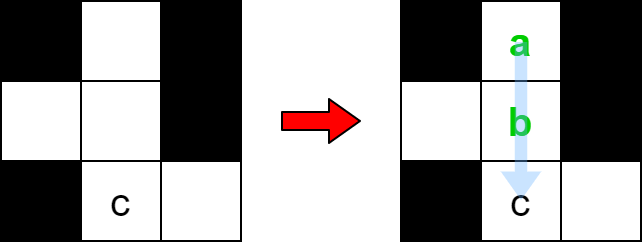
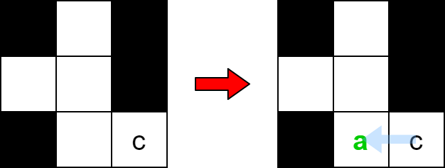

# 2018 Check if Word Can Be Placed In Crossword

You are given an m x n matrix board, representing the current state of a crossword puzzle. The crossword contains lowercase English letters (from solved words), ' ' to represent any empty cells, and '#' to represent any blocked cells.

A word can be placed horizontally (left to right or right to left) or vertically (top to bottom or bottom to top) in the board if:

* It does not occupy a cell containing the character '#'.
* The cell each letter is placed in must either be ' ' (empty) or match the letter already on the board.
* There must not be any empty cells ' ' or other lowercase letters directly left or right of the word if the word was placed horizontally.
* There must not be any empty cells ' ' or other lowercase letters directly above or below the word if the word was placed vertically.
Given a string word, return true if word can be placed in board, or false otherwise.

[LeetCode](https://leetcode.cn/problems/the-number-of-weak-characters-in-the-game/)

### Example 1



```
Input: board = [["#", " ", "#"], [" ", " ", "#"], ["#", "c", " "]], word = "abc"
Output: true
Explanation: The word "abc" can be placed as shown above (top to bottom).
```

### Example 2



```
Input: properties = [[2,2],[3,3]]
Output: 1
Explanation: The first character is weak because the second character has a strictly greater attack and defense.
```

 

### Constraints

* m == board.length
* n == board[i].length
* 1 <= m * n <= 2 * 105
* board[i][j] will be ' ', '#', or a lowercase English letter.
* 1 <= word.length <= max(m, n)
* word will contain only lowercase English letters.


### C++ 

```
class Solution {
protected:
    bool checkSpace(const string& space, const string& word){
        int&& len = space.length();
        bool match = true;
        for(int i = 0; i < len && match == true; ++i){
            if(space[i] == ' ' || space[i] == word[i])
                continue;
            else
                match = false;
        }

        if(match == true)
            return true;
        
        match = true;
        for(int i = 0; i < len && match == true; ++i){
            if(space[i] == ' ' || space[i] == word[len - i - 1])
                continue;
            else
                match = false;
        }

        return match;
    }
public:
    bool placeWordInCrossword(vector<vector<char>>& board, string word) {
        /*
            逐行逐列的找出 空格，若空格數與word的長度一致，則比較是否相等
        */
        int&& rowNum = board.size();
        int&& colNum = board[0].size();
        int&& wordLen = word.length();

        for(int row = 0; row < rowNum; ++row){
            for(int col = 0; col < colNum; ++col){
                if(board[row][col] != '#'){
                    int len = 0;
                    string tmp;
                    while(col < colNum && board[row][col] != '#'){
                        ++len;
                        tmp.push_back(board[row][col++]);
                    }

                    if(len == wordLen && checkSpace(tmp, word) == true)
                        return true;                    
                }

            }
        }

        for(int col = 0; col < colNum; ++col){
            for(int row = 0; row < rowNum; ++row){
                if(board[row][col] != '#'){
                    int len = 0;
                    string tmp;
                    while(row < rowNum && board[row][col] != '#'){
                        ++len;
                        tmp.push_back(board[row++][col]);
                    }

                    if(len == wordLen && checkSpace(tmp, word) == true)
                        return true; 
                }
            }
        }

        return false;
    }
};
```