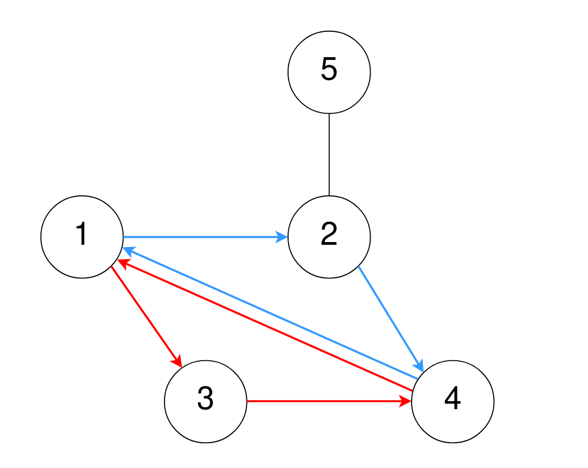
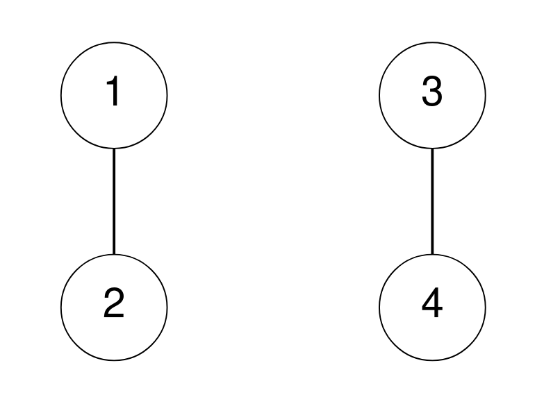

# 2077 Paths in Maze That Lead to Same Room

A maze consists of n rooms numbered from 1 to n, and some rooms are connected by corridors. You are given a 2D integer array corridors where corridors[i] = [room1i, room2i] indicates that there is a corridor connecting room1i and room2i, allowing a person in the maze to go from room1i to room2i and vice versa.

The designer of the maze wants to know how confusing the maze is. The confusion score of the maze is the number of different cycles of length 3.

* For example, 1 → 2 → 3 → 1 is a cycle of length 3, but 1 → 2 → 3 → 4 and 1 → 2 → 3 → 2 → 1 are not.
Two cycles are considered to be different if one or more of the rooms visited in the first cycle is not in the second cycle.

Return the confusion score of the maze.


[LeetCode](https://leetcode.cn/problems/paths-in-maze-that-lead-to-same-room/)


### Example 1



```
Input: n = 5, corridors = [[1,2],[5,2],[4,1],[2,4],[3,1],[3,4]]
Output: 2
Explanation:
One cycle of length 3 is 4 → 1 → 3 → 4, denoted in red.
Note that this is the same cycle as 3 → 4 → 1 → 3 or 1 → 3 → 4 → 1 because the rooms are the same.
Another cycle of length 3 is 1 → 2 → 4 → 1, denoted in blue.
Thus, there are two different cycles of length 3.
```

### Example 2



```
Input: n = 4, corridors = [[1,2],[3,4]]
Output: 0
Explanation:
There are no cycles of length 3.
```


### Constraints

* 2 <= n <= 1000
* 1 <= corridors.length <= 5 * 10<sup>4</sup>
* corridors[i].length == 2
* 1 <= room1i, room2i <= n
* room1i != room2i
* There are no duplicate corridors.


### C++ 

```
class Solution {
public:
    int numberOfPaths(int n, vector<vector<int>>& corridors) {
        /*
            這個計分的方式是計算有沒有三個點成環
            由i = 3開始(p1)，其相連的點為(p2), 其相連的點為(P3)
            若P3與P1相可得1個環
        */
        unordered_map<int, vector<int>> routes;
        unordered_map<int, unordered_set<int>> routeSet;
        for(vector<int>& corridor : corridors){
            if(corridor[0] < corridor[1])
                swap(corridor[0], corridor[1]);
            routes[corridor[0]].push_back(corridor[1]);
            routeSet[corridor[0]].insert(corridor[1]);
        }

        int ret = 0;
        for(int i = 3; i <= n; ++i){
            vector<int>& points = routes[i];
            int&& len = points.size();
            if(len > 1){
                for(int i = 1; i < len; ++i){
                    for(int j = 0; j < i; ++j){
                        // 如果這兩點相連，計數+1
                        if(routeSet[points[i]].contains(points[j]) || routeSet[points[j]].contains(points[i]))
                            ++ret;
                    }
                }
            }
        }
        
        return ret;
    }
};
```