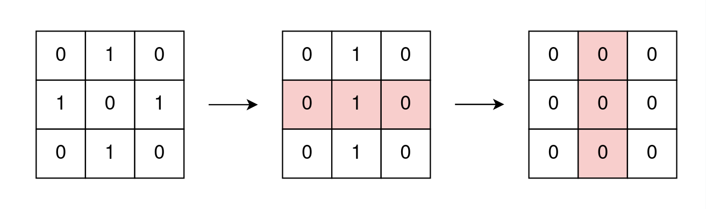
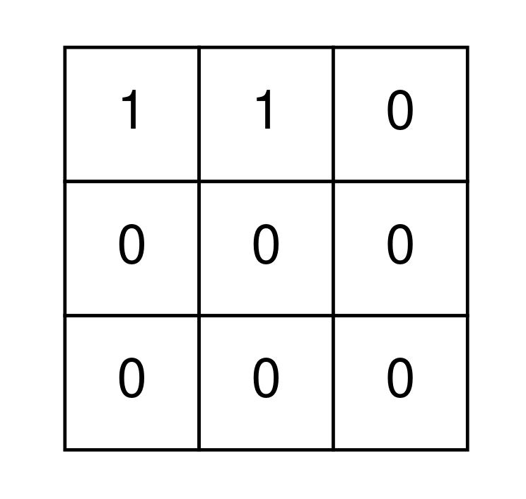

# 2128 Remove All Ones With Row and Column Flips

You are given an m x n binary matrix grid.

In one operation, you can choose any row or column and flip each value in that row or column (i.e., changing all 0's to 1's, and all 1's to 0's).

Return true if it is possible to remove all 1's from grid using any number of operations or false otherwise.

[LeetCode](https://leetcode.cn/problems/remove-all-ones-with-row-and-column-flips/)


### Example 1




```
Input: grid = [[0,1,0],[1,0,1],[0,1,0]]
Output: true
Explanation: One possible way to remove all 1's from grid is to:
- Flip the middle row
- Flip the middle column
```

### Example 2



```
Input: grid = [[1,1,0],[0,0,0],[0,0,0]]
Output: false
Explanation: It is impossible to remove all 1's from grid.
```


### Constraints

* m == grid.length
* n == grid[i].length
* 1 <= m, n <= 300
* grid[i][j] is either 0 or 1.

### C++ 

```
class Solution {
protected:
    bool isSame(vector<int> arr1, vector<int> arr2){
        int target = arr1.front() ^ arr2.front();
        for(int i = 0; i < arr1.size(); ++i){
            if((arr1[i] ^ arr2[i]) != target)
                return false;
        }

        return true;
    }
public:
    bool removeOnes(vector<vector<int>>& grid) {
        /*
            1. 每一個row / col可以整理成一樣       
            2. 為方便遍歷檢視，將所有的首元素全整理成1     
        */

        for(int row = 1; row < grid.size(); ++row){
            if(isSame(grid[0], grid[row]) != true)
                return false;
        }        

        return true;
    }
};
```