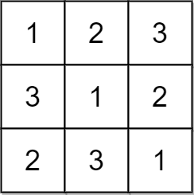
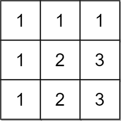

# 2133 Check if Every Row and Column Contains All Numbers

An n x n matrix is valid if every row and every column contains all the integers from 1 to n (inclusive).

Given an n x n integer matrix matrix, return true if the matrix is valid. Otherwise, return false.Otherwise return `false`.
 

[LeetCode](https://leetcode.cn/problems/check-if-every-row-and-column-contains-all-numbers/)


### Example 1



```
Input: matrix = [[1,2,3],[3,1,2],[2,3,1]]
Output: true
Explanation: In this case, n = 3, and every row and column contains the numbers 1, 2, and 3.
Hence, we return true.
```

### Example 2



```
Input: matrix = [[1,1,1],[1,2,3],[1,2,3]]
Output: false
Explanation: In this case, n = 3, but the first row and the first column do not contain the numbers 2 or 3.
Hence, we return false.
```

### Constraints

* n == matrix.length == matrix[i].length
* 1 <= n <= 100
* 1 <= matrix[i][j] <= n

### C++ 

```
class Solution {
public:
    bool checkValid(vector<vector<int>>& matrix) {
        /*
            矩陣的任一row/col必由1 - n組成
        */
        int&& len = matrix.size();
        vector<bool> rowCheck(len, false);
        vector<bool> colCheck(len, false);
        for(int i = 0; i < len; ++i){
            fill(rowCheck.begin(), rowCheck.end(), false);
            fill(colCheck.begin(), colCheck.end(), false);
            for(int j = 0; j < len; ++j){
                //檢查row
                const int& rowNum = matrix[i][j];
                if(rowCheck[rowNum - 1] == true)
                    return false;
                else
                    rowCheck[rowNum - 1] = true;
                
                //檢查col
                const int& colNum = matrix[j][i];
                if(colCheck[colNum - 1] == true)
                    return false;
                else
                    colCheck[colNum - 1] = true;
            }
        }
        
        return true;
    }
};
```