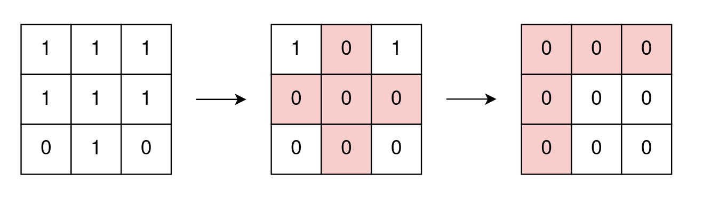
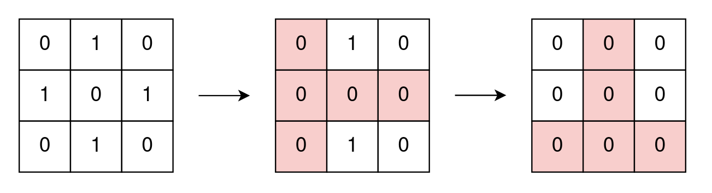

# 2174  Remove All Ones With Row and Column Flips II

You are given a 0-indexed m x n binary matrix grid.

In one operation, you can choose any i and j that meet the following conditions:

* 0 <= i < m
* 0 <= j < n
* grid[i][j] == 1
and change the values of all cells in row i and column j to zero.

Return the minimum number of operations needed to remove all 1's from grid.

 

[LeetCode](https://leetcode.cn/problems/remove-all-ones-with-row-and-column-flips-ii/)


### Example 1



```
Input: grid = [[1,1,1],[1,1,1],[0,1,0]]
Output: 2
Explanation:
In the first operation, change all cell values of row 1 and column 1 to zero.
In the second operation, change all cell values of row 0 and column 0 to zero.
```

### Example 2



```
Input: grid = [[0,1,0],[1,0,1],[0,1,0]]
Output: 2
Explanation:
In the first operation, change all cell values of row 1 and column 0 to zero.
In the second operation, change all cell values of row 2 and column 1 to zero.
Note that we cannot perform an operation using row 1 and column 1 because grid[1][1] != 1.
```


### Constraints

* m == grid.length
* n == grid[i].length
* 1 <= m, n <= 15
* 1 <= m * n <= 15
* grid[i][j] is either 0 or 1.

### C++ 

```
class Solution {        
public:
    int removeOnes(vector<vector<int>>& grid) {
        /*
           1. row * col < 15範圍相當的小
           2. 當所有的1皆清除，如何快速的判定，狀態壓縮，將所有1的位置以1個32bit的整數表示
           3. 最小步數，使用BFS搜索，將目前的狀態入隊，以每個為1的位置為消除點拓展開來
              當有狀態為0的出現時，即為以最小步數達成
        */
        int&& rowNum = grid.size();
        int&& colNum = grid[0].size();
        int&& total = rowNum * colNum;

        int initial = 0;
        int cnt = 0;
        for(int row = 0; row < rowNum;  ++row){
            for(int col = 0; col < colNum; ++col){
                if(grid[row][col] == 1){
                    initial |= 1 << (row * colNum + col);
                    ++cnt;
                }
            }
        }
        if(cnt == total)
            return min(rowNum, colNum);
        else if(cnt == 0)
            return 0;
        else if(rowNum == 1 || colNum == 1)
            return 1;

        queue<int> que;
        unordered_set<int> visted;
        
        que.push(initial);
        int step = 0;
        
        while(que.empty() != true){
            int&& len = que.size();
            while(len--){
                int curr = move(que.front());
                que.pop();
                //這個狀態所有可以執行消除的點
                for(int i = 0; i < 32; ++i){
                    if(curr & (1 << i)){
                        int next = curr;
                        int&& rowStart = i / colNum * colNum;
                        for(int j = rowStart; j < rowStart + colNum; ++j){
                            if(next & (1 << j))
                                next ^= 1 << j;
                        }
                        int&& colStart = i % colNum;
                        for(int j = colStart; j < total; j += colNum){
                            if(next & (1 << j))
                                next ^= 1 << j;
                        }

                        if(next == 0)
                            return step + 1;  
                        if(visted.insert(next).second)
                            que.push(move(next));  
                    }
                }
            } 
            ++step;           
        }

        return 0;
    }
};
```