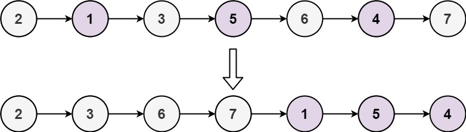

# 328 奇偶鍊表

給定單鏈表的頭節點 head ，將所有索引為奇數的節點和索引為偶數的節點分別組合在一起，然後返回重新排序的列表。

第一個節點的索引被認為是 奇數 ， 第二個節點的索引為 偶數 ，以此類推。

請注意，偶數組和奇數組內部的相對順序應該與輸入時保持一致。

你必須在 O(1) 的額外空間覆雜度和 O(n) 的時間覆雜度下解決這個問題。

##  Odd Even Linked List

Given the head of a singly linked list, group all the nodes with odd indices together followed by the nodes with even indices, and return the reordered list.

The first node is considered odd, and the second node is even, and so on.

Note that the relative order inside both the even and odd groups should remain as it was in the input.

You must solve the problem in O(1) extra space complexity and O(n) time complexity.
 
[LeetCode](https://leetcode.cn/problems/odd-even-linked-list/)

### Example 1


> Input: head = [1,2,3,4,5]  
Output: [1,3,5,2,4]


### Example 2



> Input: head = [2,1,3,5,6,4,7]  
Output: [2,3,6,7,1,5,4]


### Constraints

* The number of nodes in the linked list is in the range [0, 104].
* -10<sup>6</sup> <= Node.val <= 10<sup>6</sup>


### C++ 

```
/**
 * Definition for singly-linked list.
 * struct ListNode {
 *     int val;
 *     ListNode *next;
 *     ListNode() : val(0), next(nullptr) {}
 *     ListNode(int x) : val(x), next(nullptr) {}
 *     ListNode(int x, ListNode *next) : val(x), next(next) {}
 * };
 */
class Solution {
public:
    ListNode* oddEvenList(ListNode* head) {
        ListNode* dummyOdd = new ListNode(0);
        ListNode* dummyEven = new ListNode(0);
        ListNode* oddTail = dummyOdd;
        ListNode* evenTail = dummyEven;

        bool odd = true;
        while(head != nullptr){
            ListNode* tmp = head;
            head = head -> next;
            if(odd == true){
                oddTail -> next = tmp;
                oddTail = oddTail -> next;
                oddTail -> next = nullptr;
            }
            else{
                evenTail -> next = tmp;
                evenTail = evenTail -> next;
                evenTail -> next = nullptr;
            }
            
            odd ^= 1;
        }

        oddTail -> next = dummyEven -> next;

        return dummyOdd -> next;
    }
};
```