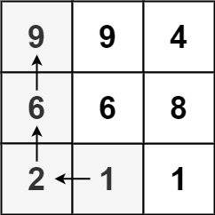

# 329 矩陣中的最長遞增路徑

給定一個 m x n 整數矩陣 matrix ，找出其中 最長遞增路徑 的長度。

對於每個單元格，你可以往上，下，左，右四個方向移動。 你 不能 在 對角線 方向上移動或移動到 邊界外（即不允許環繞）。

##  Odd Even Linked List

Given an m x n integers matrix, return the length of the longest increasing path in matrix.

From each cell, you can either move in four directions: left, right, up, or down. You may not move diagonally or move outside the boundary (i.e., wrap-around is not allowed).
 
[LeetCode](https://leetcode.cn/problems/odd-even-linked-list/)

### Example 1



> Input: matrix = [[3,4,5],[3,2,6],[2,2,1]]  
Output: 4  
Explanation: The longest increasing path is [3, 4, 5, 6]. Moving diagonally is not allowed.


### Example 2


> Input: head = [2,1,3,5,6,4,7]  
Output: [2,3,6,7,1,5,4]


### Constraints

* m == matrix.length
* n == matrix[i].length
* 1 <= m, n <= 200
* 0 <= matrix[i][j] <= 2<sup>31</sup> - 1


### C++ 

O(mn)，其中 m 和 n 分別是矩陣的行數和列數

```
class Solution {
protected:
    const int moves[4][2] = {{-1,0},{1,0},{0,-1},{0,1}}; //上下左右
    int numRow{0};
    int numCol{0};
    vector<vector<int>> visted;
    int dfs(const int& row, const int& col, const vector<vector<int>>& matrix){
        int& value = visted[row][col];
        if(value != 0)
            return value;

        //第一次踏上這個點，這個點本身就有一個數字，故最短長度為1
        value = 1;
        for(int i = 0; i < 4; ++i){
            int&& nextRow = row + moves[i][0];
            int&& nextCol = col + moves[i][1];
            if(nextRow >= 0 && nextRow < numRow && nextCol >= 0 && nextCol < numCol){
                if(matrix[nextRow][nextCol] > matrix[row][col]){
                    int&& tmp = dfs(nextRow, nextCol, matrix);
                    visted[row][col] = max(visted[row][col], 1 + tmp);
                }
            }
        }

        return visted[row][col];
    }
public:
    int longestIncreasingPath(vector<vector<int>>& matrix) {
        /*
            最暴力的方式就是從每一個位置進行DFS，但這樣子會超時
            為了節省時間，我們使用記憶化，記憶從該位置出發，有多少個比他大的值
        */
        numRow = matrix.size();
        numCol = matrix[0].size();        
        visted.resize(numRow, vector<int>(numCol, 0));
        
        int ret = 1;

        for(int row = 0; row < numRow; ++row){
            for(int col = 0; col < numCol; ++col){
                ret = max(ret, dfs(row, col, matrix));
            }
        }        
        
        return ret;
    }
};
```

```
class Solution {
public:
    int longestIncreasingPath(vector<vector<int>>& matrix) {
        /*
            Dynammic programming
            初始化相同大小的矩陣，另所有的值為1
            在一個while loop 中，遍歷所有的元素
                與相鄰的相比，若其值比本身小， 新值 = 鄰近位置 + 1
                若新值 > 原本的值，更新
                若這一輪都沒有任何的值被更新，可退出while loop
        */
        int moves[4][2] = {{-1,0},{1,0},{0,-1},{0,1}}; //上下左右

        int&& numRow = matrix.size();
        int&& numCol = matrix[0].size();

        vector<vector<int>> dp(numRow, vector<int>(numCol, 1));
        bool changed = true;
        int ret = 1;

        while(changed == true){
            changed = false;

            for(int row = 0; row < numRow; ++row){
                for(int col = 0; col < numCol; ++col){
                    for(int i = 0; i < 4; ++i){
                        int&& nextRow = row + moves[i][0];
                        int&& nextCol = col + moves[i][1];

                        if(nextRow >= 0 && nextRow < numRow && nextCol >= 0 && nextCol < numCol && matrix[nextRow][nextCol] < matrix[row][col]){
                            if(dp[nextRow][nextCol] + 1 > dp[row][col]){
                                dp[row][col] = dp[nextRow][nextCol] + 1;
                                ret = max(ret, dp[row][col]);
                                changed = true;
                            }
                        }
                    }
                }
            }
        }
        
        return ret;
    }
};
```