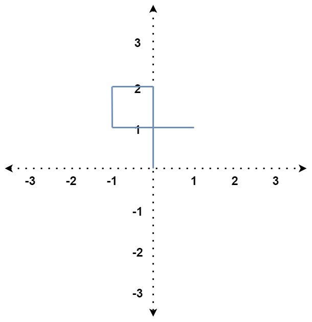
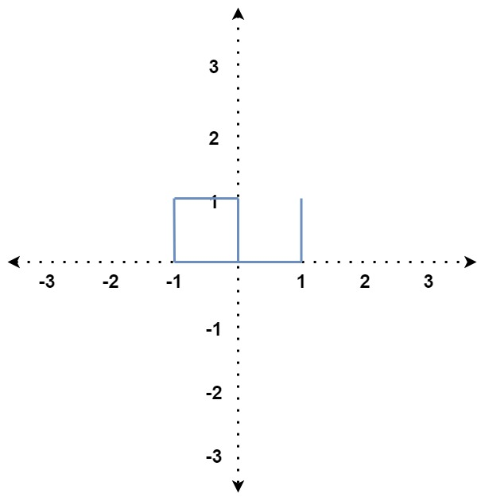

# 335 路徑交叉

給你一個整數數組 distance 。

從 X-Y 平面上的點 (0,0) 開始，先向北移動 distance[0] 米，然後向西移動 distance[1] 米，向南移動 distance[2] 米，向東移動 distance[3] 米，持續移動。也就是說，每次移動後你的方位會發生逆時針變化。

判斷你所經過的路徑是否相交。如果相交，返回 true ；否則，返回 false 。

##  Self Crossing

You are given an array of integers distance.

You start at the point (0, 0) on an X-Y plane, and you move distance[0] meters to the north, then distance[1] meters to the west, distance[2] meters to the south, distance[3] meters to the east, and so on. In other words, after each move, your direction changes counter-clockwise.

Return true if your path crosses itself or false if it does not.
 
[LeetCode](https://leetcode.cn/problems/self-crossing/)

### Example 1



> Input: distance = [2,1,1,2]  
Output: true  
Explanation: The path crosses itself at the point (0, 1).


### Example 2



> Input: distance = [1,1,1,2,1]  
Output: true  
Explanation: The path crosses itself at the point (0, 0).  


### Constraints

* 1 <= distance.length <= 10<sup>5</sup>
* 1 <= distance[i] <= 10<sup>5</sup>


### C++ 

O(n)

```
class Solution {
public:
    bool isSelfCrossing(vector<int>& distance) {
        int&& len = distance.size();
        if(len < 4)
            return false;

        for(int i = 3; i < len; ++i){
            if(distance[i] >= distance[i - 2] && distance[i - 1] <= distance[i - 3])
                return true;
                
            if( i == 4 && (distance[i - 1] == distance[i - 3] && distance[i] + distance[i - 4] >= distance[i - 2]))
                return true;

            if( i >= 5 && (distance[i] + distance[i - 4] >= distance[i - 2] && distance[i - 2] > distance[i - 4]
                     && distance[i - 1] <= distance[i - 3] && distance[i - 3] - distance[i - 5] <= distance[i - 1]))
                return true;
        }
        return false;
    }
}; 
```