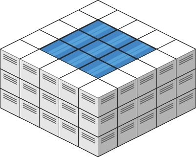

# 407 接雨水 II

給你一個 m x n 的矩陣，其中的值均為非負整數，代表二維高度圖每個單元的高度，請計算圖中形狀最多能接多少體積的雨水。

## Trapping Rain Water II

Given an 'm x n' integer matrix 'heightMap' representing the height of each unit cell in a 2D elevation map, return the volume of water it can trap after raining.

[LeetCode](https://leetcode.cn/problems/trapping-rain-water-ii/)

### Example 1


>Input: heightMap = [[1,4,3,1,3,2],[3,2,1,3,2,4],[2,3,3,2,3,1]]  
Output: 4  
Explanation: After the rain, water is trapped between the blocks.  
We have two small ponds 1 and 3 units trapped.  
The total volume of water trapped is 4.  

### Example 2



> Input: heightMap = [[3,3,3,3,3],[3,2,2,2,3],[3,2,1,2,3],[3,2,2,2,3],[3,3,3,3,3]]  
Output: 10  


### Constraints

* m == heightMap.length
* n == heightMap[i].length
* 1 <= m, n <= 200
* 0 <= heightMap[i][j] <= 2 * 10<sup>4</sup>

### C++ 

```
class Solution {
protected:
    typedef pair<int, pair<int,int>> iPair;
    struct cmp{
        bool operator()(const iPair& lhs, const iPair& rhs){
            if(lhs.first == rhs.first)
                return lhs.second.first > rhs.second.first;
            
            return lhs.first > rhs.first;
        }
    };
public:
    int trapRainWater(vector<vector<int>>& heightMap) {
        /*
            最外層的一圈無法保留雨水，將其做為初始條件的牆
            又因能決定能存多少水是由最矮的牆決定，故使用Dijkstra排序
            由最矮的最先出隊，其上下左右邊
            若較其矮，則可存水，並繼承其高度
        */
        
        int moves[4][2] = {{-1,0},{1,0},{0,-1},{0,1}};
        priority_queue<iPair, vector<iPair>, cmp> priQue;
        int&& rowNum = heightMap.size();
        int&& colNum = heightMap[0].size();

        for(int row = 0; row < rowNum; ++row){
            for(int col = 0; col < colNum; ++col){
                if(row == 0 || row == rowNum - 1 || col == 0 || col == colNum - 1){
                    priQue.emplace(heightMap[row][col], make_pair(row, col));
                    heightMap[row][col] = -1;
                }
            }
        }

        int ret = 0;

        while(priQue.empty() != true){
            iPair curr = priQue.top();
            priQue.pop();

            for(int i = 0; i < 4; ++i){
                int&& nextRow = curr.second.first + moves[i][0];
                int&& nextCol = curr.second.second + moves[i][1];
                if(nextRow < rowNum && nextRow >= 0 && nextCol < colNum && nextCol >= 0 && heightMap[nextRow][nextCol] != -1){
                    int& nextHeight = heightMap[nextRow][nextCol];
                    if(nextHeight < curr.first)
                        ret += curr.first - nextHeight;
                        
                    priQue.emplace(max(curr.first, nextHeight), make_pair(nextRow, nextCol));
                    nextHeight = -1;                   
                }
            }
        }

        return ret;
    }
};
```