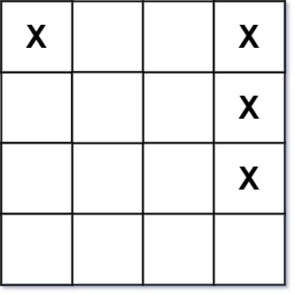

# 419 甲板上的戰艦

給你一個大小為 m x n 的矩陣 board 表示甲板，其中，每個單元格可以是一艘戰艦 'X' 或者是一個空位 '.' ，返回在甲板 board 上放置的 戰艦 的數量。

戰艦 只能水平或者垂直放置在 board 上。換句話說，戰艦只能按 1 x k（1 行，k 列）或 k x 1（k 行，1 列）的形狀建造，其中 k 可以是任意大小。兩艘戰艦之間至少有一個水平或垂直的空位分隔 （即沒有相鄰的戰艦）。

##  Battleships in a Board

Given an `m x n` matrix board where each cell is a battleship `'X'` or empty `'.'`, return the number of the battleships on board.

Battleships can only be placed horizontally or vertically on board. In other words, they can only be made of the shape `1 x k` (1 row, k columns) or `k x 1` (k rows, 1 column), where k can be of any size. At least one horizontal or vertical cell separates between two battleships (i.e., there are no adjacent

[LeetCode](https://leetcode.cn/problems/battleships-in-a-board/)

### Example 1



>Input: board = [["X",".",".","X"],[".",".",".","X"],[".",".",".","X"]]  
Output: 2

### Example 2

> Input: board = [["."]]  
Output: 0


### Constraints

* m == board.length
* n == board[i].length
* 1 <= m, n <= 200
* board[i][j] is either '.' or 'X'.

### C++ 

```
class Solution {
protected:
    typedef pair<int, int> iPair;
    int rowNum{0};
    int colNum{0};
    const int moves[4][2] = {{-1,0},{1,0},{0,-1},{0,1}};
    void bfs(vector<vector<char>>& board, const int& row, const int& col){

        board[row][col] = '.';
        queue<iPair> que;
        que.emplace(row, col);

        while(que.empty() != true){
            iPair curr = que.front();
            que.pop();

            for(int i = 0; i < 4; ++i){
                int&& nextRow = curr.first + moves[i][0];
                int&& nextCol = curr.second + moves[i][1];

                if(nextRow >= 0 && nextRow < rowNum && nextCol >= 0 && nextCol < colNum && board[nextRow][nextCol] == 'X'){
                    que.emplace(nextRow, nextCol);
                    board[nextRow][nextCol] = '.';
                }
            }
        }
    }
public:
    int countBattleships(vector<vector<char>>& board) {
        /*
            模板化題目：BFS
        */
        rowNum = board.size();
        colNum = board[0].size();
        int ret = 0;

        for(int row = 0; row < rowNum; ++row){
            for(int col = 0; col < colNum; ++col){
                if(board[row][col] == 'X' ){
                    bfs(board, row, col);
                    ++ret;
                }
            }
        }

        return ret;
    }
};
```