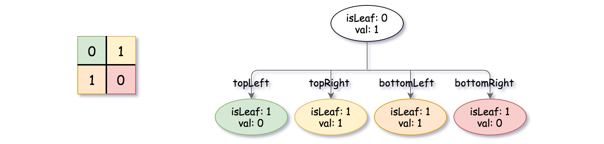

# 427 建立四叉樹

給你一個 n * n 矩陣 grid ，矩陣由若幹 0 和 1 組成。請你用四叉樹表示該矩陣 grid 。

你需要返回能表示矩陣 grid 的 四叉樹 的根結點。

四叉樹數據結構中，每個內部節點只有四個子節點。此外，每個節點都有兩個屬性：

val：儲存葉子結點所代表的區域的值。1 對應 True，0 對應 False。注意，當 isLeaf 為 False 時，你可以把 True 或者 False 賦值給節點，兩種值都會被判題機制 接受 。
isLeaf: 當這個節點是一個葉子結點時為 True，如果它有 4 個子節點則為 False 。
>class Node {  
    public boolean val;  
    public boolean isLeaf;  
    public Node topLeft;  
    public Node topRight;  
    public Node bottomLeft;  
    public Node bottomRight;  
}  

我們可以按以下步驟為二維區域構建四叉樹：

如果當前網格的值相同（即，全為 0 或者全為 1），將 isLeaf 設為 True ，將 val 設為網格相應的值，並將四個子節點都設為 Null 然後停止。
如果當前網格的值不同，將 isLeaf 設為 False， 將 val 設為任意值，然後如下圖所示，將當前網格劃分為四個子網格。
使用適當的子網格遞歸每個子節點。

##  Construct Quad Treen

Given a `n * n` matrix `grid` of `0's` and `1's` only. We want to represent grid with a Quad-Tree.

Return the root of the Quad-Tree representing grid.

A Quad-Tree is a tree data structure in which each internal node has exactly four children. Besides, each node has two attributes:

val: True if the node represents a grid of 1's or False if the node represents a grid of 0's. Notice that you can assign the val to True or False when isLeaf is False, and both are accepted in the answer.
isLeaf: True if the node is a leaf node on the tree or False if the node has four children.
> class Node {  
    public boolean val;  
    public boolean isLeaf;  
    public Node topLeft;  
    public Node topRight;  
    public Node bottomLeft;  
    public Node bottomRight;  
}  

We can construct a Quad-Tree from a two-dimensional area using the following steps:

1. If the current grid has the same value (i.e all 1's or all 0's) set isLeaf True and set val to the value of the grid and set the four children to Null and stop.
2. If the current grid has different values, set isLeaf to False and set val to any value and divide the current grid into four sub-grids as shown in the photo.
3. Recurse for each of the children with the proper sub-grid.

[LeetCode](https://leetcode.cn/problems/construct-quad-tree/)

### Example 1


>Input: grid = [[0,1],[1,0]]  
Output: [[0,1],[1,0],[1,1],[1,1],[1,0]]  
Explanation: The explanation of this example is shown below:
Notice that 0 represents False and 1 represents True in the photo representing the Quad-Tree.



### Example 2


> Input: grid = [[1,1,1,1,0,0,0,0],[1,1,1,1,0,0,0,0],[1,1,1,1,1,1,1,1],[1,1,1,1,1,1,1,1],[1,1,1,1,0,0,0,0],[1,1,1,1,0,0,0,0],[1,1,1,1,0,0,0,0],[1,1,1,1,0,0,0,0]]  
Output: [[0,1],[1,1],[0,1],[1,1],[1,0],null,null,null,null,[1,0],[1,0],[1,1],[1,1]]  


### Constraints

* 0 <= bank.length <= 10
* startGene.length == endGene.length == bank[i].length == 8
* startGene, endGene, and bank[i] consist of only the characters ['A', 'C', 'G', 'T'].

### C++ 

```
class Solution {
protected:
    vector<vector<int>> prefix;
    Node* dfs(const vector<vector<int>>& grid, const int& row, const int& col, const int& length){
        // 如果只剩一個點，即長度為1，即為葉子結點
        if(length == 1)
           return new Node(grid[row][col], true);
        
        // 檢查這一區塊能否成為葉子結點，即區塊內所有的值為1或0
        int&& sum = prefix[row + length][col + length] - prefix[row + length][col] - prefix[row][col + length] + prefix[row][col];
        if(sum == 0 || sum == length * length)
            return new Node(grid[row][col], true);
        
        //不是葉子節點，統一設為1，false
        Node* tmpNode = new Node(1, false);
        int&& nodeLen = length >> 1;
        tmpNode->topLeft = dfs(grid, row, col, nodeLen);
        tmpNode->topRight = dfs(grid, row, col + nodeLen, nodeLen);
        tmpNode->bottomLeft = dfs(grid, row + nodeLen, col, nodeLen);
        tmpNode->bottomRight = dfs(grid, row + nodeLen, col + nodeLen, nodeLen);

        return tmpNode;
    }
public:
    Node* construct(vector<vector<int>>& grid) {
        /*
            [0,1]
            [1,0] 使用dfs建立節點
            1. 給予每個節點的左上角位置，及邊長，dfs回傳該節點的指針
            2. 每次都要檢查內部的原素是不是全1或全0很花時間，使用prefix紀錄
        */
        int&& rowNum = grid.size();
        int&& colNum = grid[0].size();

        prefix.resize(rowNum + 1, vector<int>(colNum + 1));
        for(int row = 1; row <= rowNum; ++row){
            for(int col = 1; col <= colNum; ++col){
                prefix[row][col] = prefix[row - 1][col] + prefix[row][col - 1] - prefix[row - 1][col - 1] + grid[row - 1][col - 1];
            }
        }
        
        Node* root = dfs(grid, 0, 0, rowNum);        

        return root;
    }
};
```