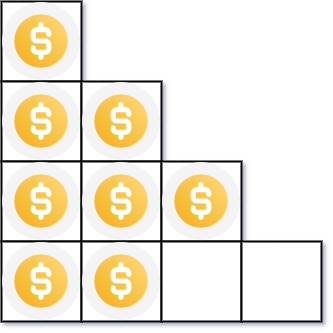

# 441 排列硬幣

你總共有 n 枚硬幣，並計劃將它們按階梯狀排列。對於一個由 k 行組成的階梯，其第 i 行必須正好有 i 枚硬幣。階梯的最後一行 可能 是不完整的。

給你一個數字 n ，計算並返回可形成 完整階梯行 的總行數。

##  Arranging Coins

You have n coins and you want to build a staircase with these coins. The staircase consists of k rows where the ith row has exactly i coins. The last row of the staircase may be incomplete.

Given the integer n, return the number of complete rows of the staircase you will build.

[LeetCode](https://leetcode.cn/problems/arranging-coins/)

### Example 1


> Input: nums = [1,2,3]  
Output: [1,2]  
Explanation: [1,3] is also accepted.

### Example 2



> Input: nums = [1,2,4,8]  
Output: [1,2,4,8]


### Constraints

* 1 <= n <= 2<sup>31</sup>-1


### C++ 

```
class Solution {
protected:
    uint64_t calculate(const uint64_t& a){
        return a*(a + 1) >> 1;
    }
public:
    int arrangeCoins(int n) {
        /*
            數學：第一排1個，第i 排 i 個
            總計有 (1 + i) i / 2
            二分法，數值 > n: right = mid - 1
            數值 <= n left = mid
        */

        int left = 1; //因為n最小為1
        int right = n;
        while(left < right){
            int&& mid = left + ((right - left + 1) >> 1);
            uint64_t&& coins = calculate(mid);

            if(coins > n)
                right = mid - 1;
            else
                left = mid;
        }

        return left;
    }
};
```