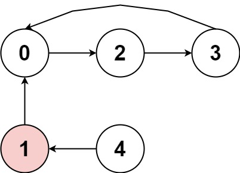

# 457. 環形數組是否存在循環

存在一個不含 0 的 環形 數組 nums ，每個 nums[i] 都表示位於下標 i 的角色應該向前或向後移動的下標個數：

* 如果 nums[i] 是正數，向前（下標遞增方向）移動 |nums[i]| 步
* 如果 nums[i] 是負數，向後（下標遞減方向）移動 |nums[i]| 步

因為數組是 環形 的，所以可以假設從最後一個元素向前移動一步會到達第一個元素，而第一個元素向後移動一步會到達最後一個元素。

我們可這個環形數組一些限制，當:

* 遵循上述移動規則將導致一組重覆下標序列 seq[0] -> seq[1] -> ... -> seq[k - 1] -> seq[0] -> ...
* 所有 nums[seq[j]] 應當不是 全正 就是 全負
* k > 1

如果 nums 中存在循環，返回 true ；否則，返回 false 。

##  Circular Array Loop

You are playing a game involving a circular array of non-zero integers nums. Each nums[i] denotes the number of indices forward/backward you must move if you are located at index i:

* If nums[i] is positive, move nums[i] steps forward, and
* If nums[i] is negative, move nums[i] steps backward.
Since the array is circular, you may assume that moving forward from the last element puts you on the first element, and moving backwards from the first element puts you on the last element.

A cycle in the array consists of a sequence of indices seq of length k where:

* Following the movement rules above results in the repeating index sequence seq[0] -> seq[1] -> ... -> seq[k - 1] -> seq[0] -> ...
* Every nums[seq[j]] is either all positive or all negative.
* k > 1

Return true if there is a cycle in nums, or false otherwise.

[LeetCode](https://leetcode.cn/problems/circular-array-loop/)

### Example 1



> Input: nums = [2,-1,1,2,2]   
Output: true  
Explanation: The graph shows how the indices are connected. White nodes are jumping forward, while red is jumping backward.  
We can see the cycle 0 --> 2 --> 3 --> 0  

### Example 2


> Input: nums = [-1,-2,-3,-4,-5,6]  
Output: false  
Explanation: The graph shows how the indices are connected. White nodes are jumping forward, while red is jumping backward.  
The only cycle is of size 1, so we return false.  


### Constraints

* 1 <= nums.length <= 5000
* -1000 <= nums[i] <= 1000
* nums[i] != 0

### C++ 

```
class Solution {
public:
    bool circularArrayLoop(vector<int>& nums) {
      /*
          1. 要檢查有沒有環，使用雙指針
          2. 題目要求若有環，移動方向一致-> 只能為正或為負
          3. 距離大於1 ，若有環，next不能就回到原點
      */
        int&& len = nums.size();
        auto next = [&nums, &len](int i){
            return ((i + nums[i]) % len + len) % len;
        };
        
        //探索每一個點，檢查該點有沒有可能成環
        for(int i = 0; i < nums.size(); ++i){
            if(nums[i] == 0)    
                continue;

            int slow = i; 
            int fast = next(slow);
            while(nums[slow] * nums[fast] > 0 && nums[slow] * nums[next(fast)] > 0){
                if(slow == fast){
                    if(slow != next(slow))
                        return true;
                    else
                        break;
                }
                slow = next(slow);
                fast = next(next(fast));
            }
            //該點不可能，將從該點開始的下一個通通置0
            int root = i;
            while(nums[root] * nums[next(root)] > 0){
                int tmp = root;
                root = next(root);
                nums[tmp] = 0;
            }
        }
               
        return false;
    }
};
```