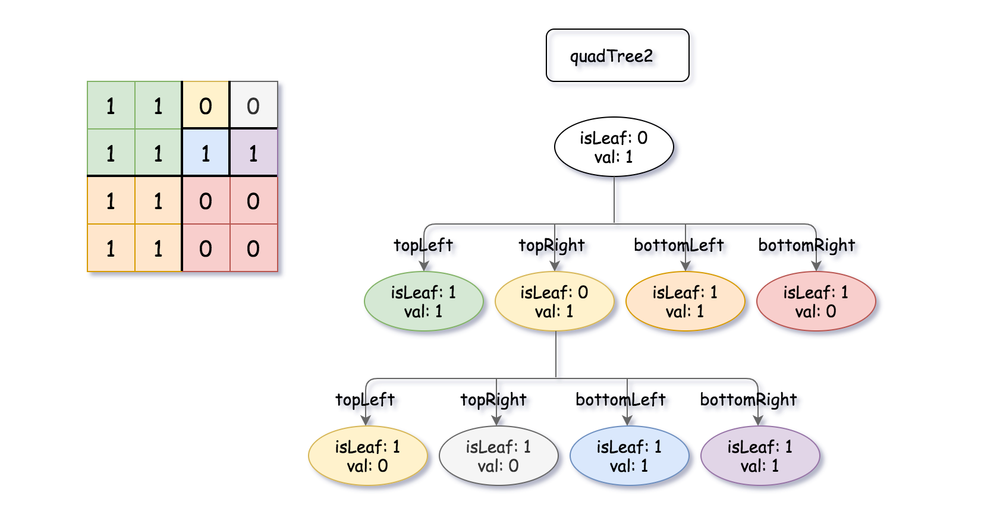
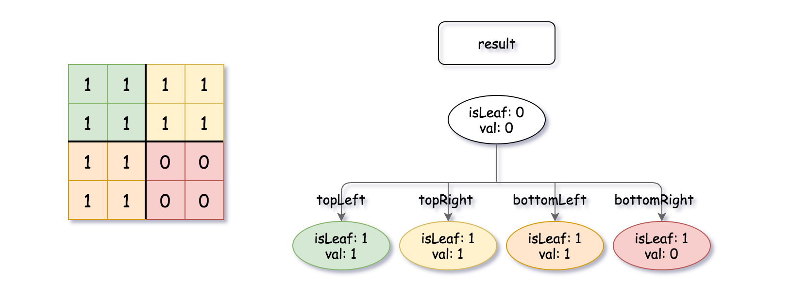

# 554 Optimal Division

A Binary Matrix is a matrix in which all the elements are either 0 or 1.

Given quadTree1 and quadTree2. quadTree1 represents a n * n binary matrix and quadTree2 represents another n * n binary matrix.

Return a Quad-Tree representing the n * n binary matrix which is the result of logical bitwise OR of the two binary matrixes represented by quadTree1 and quadTree2.

Notice that you can assign the value of a node to True or False when isLeaf is False, and both are accepted in the answer.

A Quad-Tree is a tree data structure in which each internal node has exactly four children. Besides, each node has two attributes:

* val: True if the node represents a grid of 1's or False if the node represents a grid of 0's.
* isLeaf: True if the node is leaf node on the tree or False if the node has the four children.
```
class Node {  
    public boolean val;  
    public boolean isLeaf;  
    public Node topLeft;  
    public Node topRight;  
    public Node bottomLeft;  
    public Node bottomRight;  
}  
```
We can construct a Quad-Tree from a two-dimensional area using the following steps:

1. If the current grid has the same value (i.e all 1's or all 0's) set isLeaf True and set val to the value of the grid and set the four children to Null and stop.
2. If the current grid has different values, set isLeaf to False and set val to any value and divide the current grid into four sub-grids as shown in the photo.
3. Recurse for each of the children with the proper sub-grid.
 
[LeetCode](https://leetcode.cn/problems/logical-or-of-two-binary-grids-represented-as-quad-trees/)

### Example 1



>Input: quadTree1 = [[0,1],[1,1],[1,1],[1,0],[1,0]]  
, quadTree2 = [[0,1],[1,1],[0,1],[1,1],[1,0],null,null,null,null,[1,0],[1,0],[1,1],[1,1]]  
Output: [[0,0],[1,1],[1,1],[1,1],[1,0]]  

### Example 2



>Input: quadTree1 = [[1,0]], quadTree2 = [[1,0]]  
Output: [[1,0]]

### Constraints

* `quadTree1` and `quadTree2` are both valid Quad-Trees each representing a `n * n` grid.
* `n == 2`<sup>`x`</sup> where `0 <= x <= 9`.

### C++ 

```
/*
// Definition for a QuadTree node.
class Node {
public:
    bool val;
    bool isLeaf;
    Node* topLeft;
    Node* topRight;
    Node* bottomLeft;
    Node* bottomRight;
    
    Node() {
        val = false;
        isLeaf = false;
        topLeft = NULL;
        topRight = NULL;
        bottomLeft = NULL;
        bottomRight = NULL;
    }
    
    Node(bool _val, bool _isLeaf) {
        val = _val;
        isLeaf = _isLeaf;
        topLeft = NULL;
        topRight = NULL;
        bottomLeft = NULL;
        bottomRight = NULL;
    }
    
    Node(bool _val, bool _isLeaf, Node* _topLeft, Node* _topRight, Node* _bottomLeft, Node* _bottomRight) {
        val = _val;
        isLeaf = _isLeaf;
        topLeft = _topLeft;
        topRight = _topRight;
        bottomLeft = _bottomLeft;
        bottomRight = _bottomRight;
    }
};
*/

class Solution {
public:
    Node* intersect(Node* quadTree1, Node* quadTree2) {
        /*
            1. 目標，得出兩個quadtree進行或運算的結果
            2. 每一對NODE所代表的區域是一樣的，或許一個是葉子節點，一個還有分支
               但只要任一個為葉子節點就可以得到這一區域的或運算結果
               e.g. node1 為 leaf -> 若node1 值為1 -> 這一區域的值為1
                                     若node1 值為0 -> 這一區域的值為 node2
        */
        if(quadTree1->isLeaf == true){
            if(quadTree1->val == true)
                return new Node(true, true);
            return new Node(quadTree2->val, quadTree2->isLeaf, quadTree2->topLeft, quadTree2->topRight, quadTree2->bottomLeft, quadTree2->bottomRight);
        }
        else if(quadTree2->isLeaf == true){
            //僅為上方的code從tree1改成tree2，避免重覆寫，改用dfs
            return intersect(quadTree2, quadTree1);
        }

        //當兩個都不為葉子節點時，對各自的底下四個區域作或運算
        Node* topLeft = intersect(quadTree1->topLeft, quadTree2->topLeft);
        Node* topRight = intersect(quadTree1->topRight, quadTree2->topRight);
        Node* bottomLeft = intersect(quadTree1->bottomLeft, quadTree2->bottomLeft);
        Node* bottomRight = intersect(quadTree1->bottomRight, quadTree2->bottomRight);
        if(topLeft->isLeaf && topRight->isLeaf && bottomLeft->isLeaf && bottomRight->isLeaf && \
           topLeft->val == topRight->val && topLeft->val == bottomLeft->val && topLeft->val == bottomRight->val){
               Node* ret = new Node(topLeft->val, true);
               delete topLeft;
               delete topRight;
               delete bottomLeft;
               delete bottomRight;  
               return ret;
           }
        
        return new Node(false, false, topLeft, topRight, bottomLeft, bottomRight);        
    }
};
```