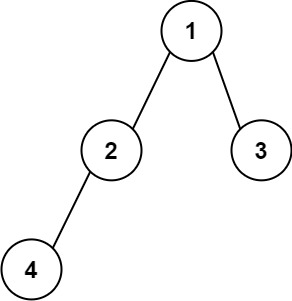

# 606 根據二叉樹創建字符串

給你二叉樹的根節點 root ，請你采用前序遍歷的方式，將二叉樹轉化為一個由括號和整數組成的字符串，返回構造出的字符串。

空節點使用一對空括號對 "()" 表示，轉化後需要省略所有不影響字符串與原始二叉樹之間的一對一映射關系的空括號對。

##  Construct String from Binary Tree

Given the root of a binary tree, construct a string consisting of parenthesis and integers from a binary tree with the preorder traversal way, and return it.

Omit all the empty parenthesis pairs that do not affect the one-to-one mapping relationship between the string and the original binary tree.

[LeetCode](https://leetcode.cn/problems/construct-string-from-binary-tree/)

### Example 1



>Input: root = [1,2,3,4]  
Output: "1(2(4))(3)"  
Explanation: Originally, it needs to be "1(2(4)())(3()())", but you need to omit all the unnecessary empty parenthesis pairs. And it will be "1(2(4))(3)"  

### Example 2


> Input: root = [1,2,3,null,4]  
Output: "1(2()(4))(3)"  
Explanation: Almost the same as the first example, except we cannot omit the first parenthesis pair to break the one-to-one mapping relationship between the input and the output.  

### Constraints

* The number of nodes in the tree is in the range [1, 10<sup>4</sup>].
* -1000 <= Node.val <= 1000

### C++ 

```
/**
 * Definition for a binary tree node.
 * struct TreeNode {
 *     int val;
 *     TreeNode *left;
 *     TreeNode *right;
 *     TreeNode() : val(0), left(nullptr), right(nullptr) {}
 *     TreeNode(int x) : val(x), left(nullptr), right(nullptr) {}
 *     TreeNode(int x, TreeNode *left, TreeNode *right) : val(x), left(left), right(right) {}
 * };
 */
class Solution {
public:
    string tree2str(TreeNode* root) {
        /*
            preOrder遍歷每一個節點，若該節點的
            1. 左節點為空同時右節點不為空，左節點補()
        */

        string ret = to_string(root->val);
        //處理左節點
        if(root->left != nullptr)
            ret += "(" + tree2str(root->left) + ")";
        else if(root->left == nullptr && root->right != nullptr)
            ret += "()";

        //處理右節點
        if(root->right != nullptr)
            ret += "(" + tree2str(root->right) + ")";

        return ret;
    }
};
```