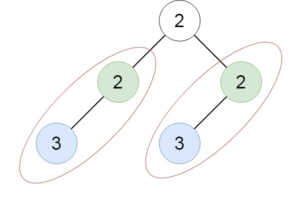

# 652 Find Duplicate Subtrees

Given the `root` of a binary tree, return all duplicate subtrees.

For each kind of duplicate subtrees, you only need to return the root node of any one of them.

Two trees are `duplicate` if they have the `same structure` with the `same node values`.
 
 
[LeetCode](https://leetcode.cn/problems/dota2-senate/)

### Example 1


>Input: root = [1,2,3,4,null,2,4,null,null,4]  
Output: [[2,4],[4]]  

### Example 2



>Input: root = [2,2,2,3,null,3,null]  
Output: [[2,3],[3]]  

### Constraints

* n == senate.length
* 1 <= n <= 10<sup>4</sup>
* senate[i] is either 'R' or 'D'.

### C++ 

```
/**
 * Definition for a binary tree node.
 * struct TreeNode {
 *     int val;
 *     TreeNode *left;
 *     TreeNode *right;
 *     TreeNode() : val(0), left(nullptr), right(nullptr) {}
 *     TreeNode(int x) : val(x), left(nullptr), right(nullptr) {}
 *     TreeNode(int x, TreeNode *left, TreeNode *right) : val(x), left(left), right(right) {}
 * };
 */
class Solution {
protected:
    unordered_map<string, TreeNode*> serial;
    unordered_set<TreeNode*> repeat;

    string postOrder(TreeNode* root){
        if(root == nullptr)
            return "";
        
        string nodeSer = to_string(root->val);
        if(root->left == nullptr && root->right != nullptr)
            nodeSer += "()";
        
        if(root->left != nullptr)
            nodeSer += "(" + postOrder(root->left) + ")";
        if(root->right != nullptr)
            nodeSer += "(" + postOrder(root->right) + ")";

        if(serial.find(nodeSer) != serial.end())
            repeat.insert(serial[nodeSer]);
        else
            serial[nodeSer] = root;
        
        return nodeSer;
    }
public:
    vector<TreeNode*> findDuplicateSubtrees(TreeNode* root) {
        /*
            透過DFS，從每一個node開始序列化，並將該序列儲存
            如果有一樣的序列，該node放入答案中
        */
        (void)postOrder(root);

        return vector<TreeNode*>{repeat.begin(), repeat.end()};
    }
};
```