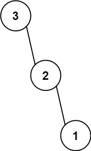

# 654 Maximum Binary Tree

You are given an integer array nums with no duplicates. A maximum binary tree can be built recursively from nums using the following algorithm:

1. Create a root node whose value is the maximum value in nums.  
2. Recursively build the left subtree on the subarray prefix to the left of the maximum value.  
3. Recursively build the right subtree on the subarray suffix to the right of the maximum value.  

Return the maximum binary tree built from nums.
 
 
[LeetCode](https://leetcode.cn/problems/maximum-binary-tree/)

### Example 1


```
Input: nums = [3,2,1,6,0,5]
Output: [6,3,5,null,2,0,null,null,1]
Explanation: The recursive calls are as follow:
- The largest value in [3,2,1,6,0,5] is 6. Left prefix is [3,2,1] and right suffix is [0,5].
    - The largest value in [3,2,1] is 3. Left prefix is [] and right suffix is [2,1].
        - Empty array, so no child.
        - The largest value in [2,1] is 2. Left prefix is [] and right suffix is [1].
            - Empty array, so no child.
            - Only one element, so child is a node with value 1.
    - The largest value in [0,5] is 5. Left prefix is [0] and right suffix is [].
        - Only one element, so child is a node with value 0.
        - Empty array, so no child.
```

### Example 2



```
Input: nums = [3,2,1]
Output: [3,null,2,null,1]
```

### Constraints

* 1 <= nums.length <= 1000
* 0 <= nums[i] <= 1000
* All integers in nums are unique.

### C++ 

* 單調棧
```
class Solution {
public:
    TreeNode* constructMaximumBinaryTree(vector<int>& nums) {
        /*
            * 1種方法是先找出某一段區間的最大值，以其將區間分成左右部份，再遞歸
              這種方法的時間複雜度會是N^2，有N個節點，每個節點都要尋找一次該區間的最大值
            * 採用另一種方式，記錄每一個元素左側及右側第一個比該元素大的值，-1代表沒有
              除了最大的元素左側及右側都沒有更大元素外，其他的
              若次大的元素在左側(右側沒有更大的元素)，則其位該次大元素的右分支
              反之則為右側次大的元素的左分支
        */
        int&& len = nums.size();
        vector<int> left(len, -1);
        vector<int> right(len, -1);
        vector<TreeNode*> tree(len);
        stack<int> idStk;

        for(int i = 0; i < len; ++i){
            tree[i] = new TreeNode(nums[i]);
            while(idStk.empty() != true && nums[i] > nums[idStk.top()]){
                right[idStk.top()] = i;
                idStk.pop();
            }

            if(idStk.empty() != true)
                left[i] =idStk.top();
            
            idStk.push(i);
        }

        // 以每一個數字建立一個TreeNode*，並將其接在稍大的值的左邊/右邊
        TreeNode* ret = nullptr;
        for(int i = 0; i < len; ++i){
            if(right[i] == -1 && left[i] == -1)
                ret = tree[i];
            else if(right[i] == -1 || (left[i] != -1 && nums[left[i]] < nums[right[i]]))
                tree[left[i]]->right = tree[i];
            else
                tree[right[i]]->left = tree[i];
        }

        return ret;
    }
};
```

* 遞歸 時間複雜度 O(n<sup>2</sup>)

```
/**
 * Definition for a binary tree node.
 * struct TreeNode {
 *     int val;
 *     TreeNode *left;
 *     TreeNode *right;
 *     TreeNode() : val(0), left(nullptr), right(nullptr) {}
 *     TreeNode(int x) : val(x), left(nullptr), right(nullptr) {}
 *     TreeNode(int x, TreeNode *left, TreeNode *right) : val(x), left(left), right(right) {}
 * };
 */
class Solution {
protected:
    TreeNode* buildTree(const int& start, const int& end, const vector<pair<int,int>>& maxId){
        if(start >= end)
            return  nullptr;

        int maxValue = INT_MIN;
        int maxIdx = INT_MIN;
        for(const auto& item : maxId){
            if(item.second >= start && item.second < end){
                if(item.first > maxValue){
                    maxValue = item.first;
                    maxIdx = item.second;
                    break;
                }
            }
        }

        TreeNode* root = new TreeNode(maxValue);
        root->left = buildTree(start, maxIdx, maxId);
        root->right = buildTree(maxIdx + 1, end, maxId);

        return root;
    }
public:
    TreeNode* constructMaximumBinaryTree(vector<int>& nums) {
        /*
            每一次都以該範選內的最大值做為root，並以其區分左右
            如何使每找尋最大值更有效率？
            暫時想到的辦法，建立一個排序的表，依次從大到小紀錄值及位置
        */
        vector<pair<int,int>> maxId;
        for(int i = 0; i < nums.size(); ++i)
            maxId.emplace_back(nums[i], i);
        
        sort(maxId.begin(), maxId.end(), greater<pair<int,int>>());

        TreeNode* root = buildTree(0, nums.size(), maxId);

        return root;
    }
};
```